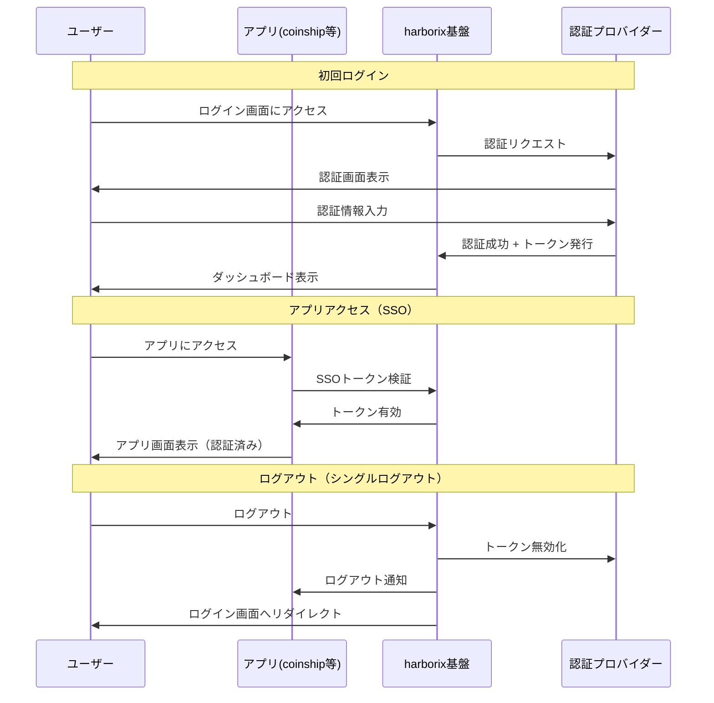

# REQ-001-03: harborix基盤 ユースケース

## 概要

harborix基盤の主要なユースケースを定義する。

## アクター定義

| アクター         | 説明                                   |
| ---------------- | -------------------------------------- |
| 未認証ユーザー   | ログインしていないユーザー             |
| 認証済みユーザー | ログイン済みのユーザー                 |
| 管理者           | アプリ管理権限を持つユーザー（開発者） |

## ユースケース一覧

### 認証系

#### UC-001: ユーザー登録（メール/パスワード）

| 項目       | 内容                                                                                                                                                                         |
| ---------- | ---------------------------------------------------------------------------------------------------------------------------------------------------------------------------- |
| アクター   | 未認証ユーザー                                                                                                                                                               |
| 事前条件   | アカウントを持っていない                                                                                                                                                     |
| 基本フロー | 1. 登録画面を開く 2. メールアドレス、パスワードを入力 3. 登録ボタンを押す 4. 確認メールを受信 5. メール内のリンクをクリック 6. 登録完了、ダッシュボードへ遷移 |
| 代替フロー | 3a. 既に登録済みのメールアドレスの場合、エラー表示                                                                                                                           |
| 事後条件   | アカウントが作成され、ログイン状態になる                                                                                                                                     |

#### UC-002: ログイン（メール/パスワード）

| 項目       | 内容                                                                                                               |
| ---------- | ------------------------------------------------------------------------------------------------------------------ |
| アクター   | 未認証ユーザー                                                                                                     |
| 事前条件   | アカウントを持っている                                                                                             |
| 基本フロー | 1. ログイン画面を開く 2. メールアドレス、パスワードを入力 3. ログインボタンを押す 4. ダッシュボードへ遷移 |
| 代替フロー | 3a. 認証失敗の場合、エラー表示                                                                                     |
| 事後条件   | SSOトークンが発行され、ログイン状態になる                                                                          |

#### UC-003: Googleログイン

| 項目       | 内容                                                                                                                                                                                       |
| ---------- | ------------------------------------------------------------------------------------------------------------------------------------------------------------------------------------------ |
| アクター   | 未認証ユーザー                                                                                                                                                                             |
| 事前条件   | Googleアカウントを持っている                                                                                                                                                               |
| 基本フロー | 1. ログイン画面を開く 2. 「Googleでログイン」ボタンを押す 3. Googleの認証画面へリダイレクト 4. Googleアカウントで認証 5. harborixへリダイレクト 6. ダッシュボードへ遷移      |
| 代替フロー | 4a. 初回ログイン時、自動でアカウント作成 4b. 既存メールアドレスと重複する場合、アカウント連携を確認                                                                                      |
| 事後条件   | SSOトークンが発行され、ログイン状態になる                                                                                                                                                  |

#### UC-004: ログアウト

| 項目       | 内容                                                                                                                                           |
| ---------- | ---------------------------------------------------------------------------------------------------------------------------------------------- |
| アクター   | 認証済みユーザー                                                                                                                               |
| 事前条件   | ログイン状態である                                                                                                                             |
| 基本フロー | 1. ユーザーメニューを開く 2. ログアウトを選択 3. SSOトークンを無効化 4. 全アプリからログアウト状態になる 5. ログイン画面へ遷移      |
| 事後条件   | harborix及び全連携アプリからログアウト状態になる                                                                                               |

#### UC-005: パスワードリセット

| 項目       | 内容                                                                                                                                                                                 |
| ---------- | ------------------------------------------------------------------------------------------------------------------------------------------------------------------------------------ |
| アクター   | 未認証ユーザー                                                                                                                                                                       |
| 事前条件   | メール/パスワードで登録済み、パスワードを忘れた                                                                                                                                      |
| 基本フロー | 1. ログイン画面で「パスワードを忘れた」を選択 2. メールアドレスを入力 3. リセットメールを受信 4. メール内のリンクをクリック 5. 新しいパスワードを入力 6. リセット完了 |
| 事後条件   | 新しいパスワードでログイン可能になる                                                                                                                                                 |

### SSO系

#### UC-006: SSOによるアプリ認証

| 項目       | 内容                                                                                                                                                                           |
| ---------- | ------------------------------------------------------------------------------------------------------------------------------------------------------------------------------ |
| アクター   | 認証済みユーザー                                                                                                                                                               |
| 事前条件   | harborixにログイン済み                                                                                                                                                         |
| 基本フロー | 1. ダッシュボードでアプリを選択 2. アプリへ遷移 3. アプリがSSOトークンを検証 4. 認証済み状態でアプリを利用開始                                                        |
| 代替フロー | 3a. トークンが無効/期限切れの場合、harborixのログイン画面へリダイレクト                                                                                                         |
| 事後条件   | アプリを認証済み状態で利用できる                                                                                                                                               |

#### UC-007: 未認証状態でのアプリアクセス

| 項目       | 内容                                                                                                                                                                           |
| ---------- | ------------------------------------------------------------------------------------------------------------------------------------------------------------------------------ |
| アクター   | 未認証ユーザー                                                                                                                                                                 |
| 事前条件   | ログインしていない状態でアプリURLに直接アクセス                                                                                                                                |
| 基本フロー | 1. アプリURLにアクセス 2. アプリがSSOトークンを確認 3. トークンなし/無効のためharborixログイン画面へリダイレクト 4. ログイン完了後、元のアプリURLへリダイレクト        |
| 事後条件   | 認証後、当初アクセスしようとしたアプリ画面が表示される                                                                                                                         |

#### UC-008: アプリからのログアウト

| 項目       | 内容                                                                                                                                                                           |
| ---------- | ------------------------------------------------------------------------------------------------------------------------------------------------------------------------------ |
| アクター   | 認証済みユーザー                                                                                                                                                               |
| 事前条件   | アプリを利用中                                                                                                                                                                 |
| 基本フロー | 1. アプリ内でログアウトを選択 2. harborixの認証基盤にログアウトリクエスト 3. SSOトークンを無効化 4. 全アプリからログアウト 5. harborixのログイン画面へリダイレクト  |
| 事後条件   | harborix及び全連携アプリからログアウト状態になる（シングルログアウト）                                                                                                          |

### ユーザー管理系

#### UC-009: プロフィール編集

| 項目       | 内容                                                                                                                                  |
| ---------- | ------------------------------------------------------------------------------------------------------------------------------------- |
| アクター   | 認証済みユーザー                                                                                                                      |
| 事前条件   | ログイン状態である                                                                                                                    |
| 基本フロー | 1. 設定画面を開く 2. プロフィールタブを選択 3. ユーザー名、アイコン等を編集 4. 保存ボタンを押す 5. 更新完了メッセージ表示 |
| 事後条件   | プロフィール情報が更新される                                                                                                          |

#### UC-010: アカウント削除

| 項目       | 内容                                                                                                                                                      |
| ---------- | --------------------------------------------------------------------------------------------------------------------------------------------------------- |
| アクター   | 認証済みユーザー                                                                                                                                          |
| 事前条件   | ログイン状態である                                                                                                                                        |
| 基本フロー | 1. 設定画面を開く 2. アカウント削除を選択 3. 確認ダイアログで削除を確定 4. パスワードを入力して確認 5. アカウント削除完了、ログイン画面へ遷移 |
| 事後条件   | アカウントと全アプリの関連データが削除される                                                                                                              |

### ダッシュボード系

#### UC-011: アプリ一覧表示

| 項目       | 内容                                                           |
| ---------- | -------------------------------------------------------------- |
| アクター   | 認証済みユーザー                                               |
| 事前条件   | ログイン状態である                                             |
| 基本フロー | 1. ダッシュボードを開く 2. 利用可能なアプリ一覧が表示される |
| 事後条件   | なし                                                           |

#### UC-012: アプリ起動

| 項目       | 内容                                                                                       |
| ---------- | ------------------------------------------------------------------------------------------ |
| アクター   | 認証済みユーザー                                                                           |
| 事前条件   | ダッシュボードを表示している                                                               |
| 基本フロー | 1. アプリカードをクリック 2. 選択したアプリへ遷移 3. SSO認証済みの状態でアプリを利用 |
| 事後条件   | アプリ画面が表示される（再ログイン不要）                                                   |

### テーマ系

#### UC-013: テーマ切り替え

| 項目       | 内容                                                                    |
| ---------- | ----------------------------------------------------------------------- |
| アクター   | 認証済みユーザー                                                        |
| 事前条件   | ログイン状態である                                                      |
| 基本フロー | 1. ヘッダーのテーマ切り替えボタンを押す 2. ダーク/ライトが切り替わる |
| 事後条件   | テーマ設定が保存され、全アプリに反映される                              |

### アプリ管理系（管理者）

#### UC-014: アプリ登録

| 項目       | 内容                                                                                                                                   |
| ---------- | -------------------------------------------------------------------------------------------------------------------------------------- |
| アクター   | 管理者                                                                                                                                 |
| 事前条件   | 管理者としてログインしている                                                                                                           |
| 基本フロー | 1. アプリ管理画面を開く 2. 新規登録を選択 3. アプリ名、URL、アイコン等を入力 4. 保存ボタンを押す 5. アプリ一覧に追加される |
| 事後条件   | 新しいアプリが登録される                                                                                                               |

## ユースケース図

```mermaid
graph TB
    subgraph アクター
        U1[未認証ユーザー]
        U2[認証済みユーザー]
        U3[管理者]
    end

    subgraph 認証系
        UC001[UC-001: ユーザー登録]
        UC002[UC-002: メール/PWログイン]
        UC003[UC-003: Googleログイン]
        UC004[UC-004: ログアウト]
        UC005[UC-005: パスワードリセット]
    end

    subgraph SSO系
        UC006[UC-006: SSOアプリ認証]
        UC007[UC-007: 未認証アプリアクセス]
        UC008[UC-008: アプリからログアウト]
    end

    subgraph ユーザー管理系
        UC009[UC-009: プロフィール編集]
        UC010[UC-010: アカウント削除]
    end

    subgraph ダッシュボード系
        UC011[UC-011: アプリ一覧表示]
        UC012[UC-012: アプリ起動]
    end

    subgraph テーマ系
        UC013[UC-013: テーマ切り替え]
    end

    subgraph アプリ管理系
        UC014[UC-014: アプリ登録]
    end

    U1 --> UC001
    U1 --> UC002
    U1 --> UC003
    U1 --> UC005
    U1 --> UC007

    U2 --> UC004
    U2 --> UC006
    U2 --> UC008
    U2 --> UC009
    U2 --> UC010
    U2 --> UC011
    U2 --> UC012
    U2 --> UC013

    U3 --> UC014
```

## SSO認証フロー図

## 変更履歴

- 2026-02-11: SSO関連ユースケース追加、mermaid図追加
- 2026-02-11: 初版作成
