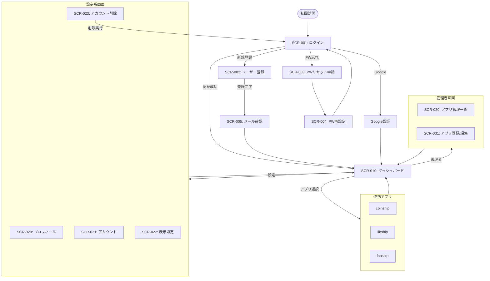

# REQ-001-04: harborix基盤 画面一覧

## 概要

harborix基盤で必要な画面を定義する。

## 画面一覧

### 認証系画面

| ID | 画面名 | 概要 | URL（案） |
| -- | ------ | ---- | --------- |
| SCR-001 | ログイン画面 | メールアドレス/パスワード入力 | /login |
| SCR-002 | ユーザー登録画面 | 新規アカウント作成 | /register |
| SCR-003 | パスワードリセット申請画面 | メールアドレス入力 | /password/reset |
| SCR-004 | パスワード再設定画面 | 新パスワード入力 | /password/reset/:token |
| SCR-005 | メール確認完了画面 | 登録完了メッセージ | /verify-email/:token |

### メイン画面

| ID | 画面名 | 概要 | URL（案） |
| -- | ------ | ---- | --------- |
| SCR-010 | ダッシュボード | アプリ一覧表示 | / |

### 設定系画面

| ID | 画面名 | 概要 | URL（案） |
| -- | ------ | ---- | --------- |
| SCR-020 | 設定画面（プロフィール） | ユーザー情報編集 | /settings/profile |
| SCR-021 | 設定画面（アカウント） | メールアドレス/パスワード変更 | /settings/account |
| SCR-022 | 設定画面（表示） | テーマ設定 | /settings/appearance |
| SCR-023 | アカウント削除確認画面 | 削除前の確認 | /settings/delete-account |

### 管理者画面

| ID | 画面名 | 概要 | URL（案） |
| -- | ------ | ---- | --------- |
| SCR-030 | アプリ管理一覧 | 登録アプリの一覧 | /admin/apps |
| SCR-031 | アプリ登録/編集画面 | アプリ情報の入力 | /admin/apps/:id |

### エラー画面

| ID | 画面名 | 概要 | URL（案） |
| -- | ------ | ---- | --------- |
| SCR-040 | 404エラー | ページが見つからない | - |
| SCR-041 | 500エラー | サーバーエラー | - |
| SCR-042 | 認証エラー | 未認証時のリダイレクト先 | - |

## 画面遷移図

## 画面構成要素

### 共通ヘッダー

| 要素 | 内容 |
| ---- | ---- |
| ロゴ | harborixロゴ（クリックでダッシュボードへ） |
| ナビゲーション | ダッシュボード、設定 |
| テーマ切り替え | ダーク/ライト切り替えボタン |
| ユーザーメニュー | プロフィール、ログアウト |

### 共通フッター（任意）

| 要素 | 内容 |
| ---- | ---- |
| コピーライト | © 2026 Harborix |
| リンク | プライバシーポリシー、利用規約（将来） |

## 画面数サマリー

| カテゴリ | 画面数 |
| -------- | ------ |
| 認証系 | 5 |
| メイン | 1 |
| 設定系 | 4 |
| 管理者 | 2 |
| エラー | 3 |
| **合計** | **15** |

## 変更履歴

- 2026-02-11: 画面遷移図をmermaid記法に変更
- 2026-02-11: 初版作成
