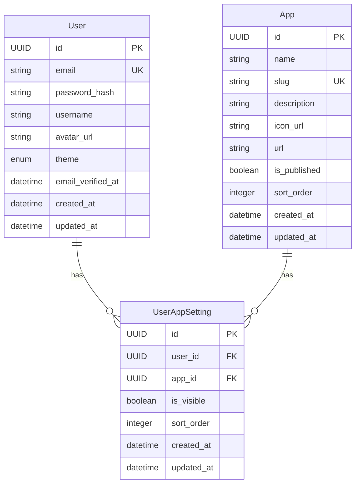

# REQ-001-05: harborix基盤 データ一覧

## 概要

harborix基盤で扱うデータを定義する。

## エンティティ一覧

### 1. ユーザー（User）

| 項目 | 内容 |
| ---- | ---- |
| 概要 | システムを利用するユーザー |
| 主な属性 | ID、メールアドレス、パスワード、ユーザー名、アイコン |

| 属性名 | 型 | 必須 | 説明 |
| ------ | -- | ---- | ---- |
| id | UUID | ○ | 一意識別子 |
| email | string | ○ | メールアドレス（ログインID） |
| password_hash | string | ○ | ハッシュ化されたパスワード |
| username | string | ○ | 表示名 |
| avatar_url | string | - | アイコン画像URL |
| theme | enum | ○ | テーマ設定（light/dark） |
| email_verified_at | datetime | - | メール確認日時 |
| created_at | datetime | ○ | 作成日時 |
| updated_at | datetime | ○ | 更新日時 |

### 2. アプリ（App）

| 項目 | 内容 |
| ---- | ---- |
| 概要 | harborixに登録されたアプリケーション |
| 主な属性 | ID、名前、URL、アイコン、説明 |

| 属性名 | 型 | 必須 | 説明 |
| ------ | -- | ---- | ---- |
| id | UUID | ○ | 一意識別子 |
| name | string | ○ | アプリ名 |
| slug | string | ○ | URL用識別子（英数字） |
| description | string | - | アプリの説明 |
| icon_url | string | - | アイコン画像URL |
| url | string | ○ | アプリのURL |
| is_published | boolean | ○ | 公開状態 |
| sort_order | integer | ○ | 表示順序 |
| created_at | datetime | ○ | 作成日時 |
| updated_at | datetime | ○ | 更新日時 |

### 3. ユーザーアプリ設定（UserAppSetting）

| 項目 | 内容 |
| ---- | ---- |
| 概要 | ユーザーごとのアプリ表示設定 |
| 主な属性 | ユーザーID、アプリID、表示/非表示、並び順 |

| 属性名 | 型 | 必須 | 説明 |
| ------ | -- | ---- | ---- |
| id | UUID | ○ | 一意識別子 |
| user_id | UUID | ○ | ユーザーID（FK） |
| app_id | UUID | ○ | アプリID（FK） |
| is_visible | boolean | ○ | 表示/非表示 |
| sort_order | integer | - | ユーザー個別の並び順 |
| created_at | datetime | ○ | 作成日時 |
| updated_at | datetime | ○ | 更新日時 |

### 4. セッション（Session）※認証プロバイダー依存

| 項目 | 内容 |
| ---- | ---- |
| 概要 | ユーザーのログインセッション |
| 備考 | 認証プロバイダー（Cognito/Supabase Auth等）が管理 |

## ER図

## リレーション

| 関係 | 説明 |
| ---- | ---- |
| User : UserAppSetting | 1 : N（1ユーザーは複数のアプリ設定を持つ） |
| App : UserAppSetting | 1 : N（1アプリは複数のユーザー設定を持つ） |

## データ量見積もり

| エンティティ | 想定レコード数 | 備考 |
| ------------ | -------------- | ---- |
| User | 〜100 | 個人利用がメイン |
| App | 〜10 | 拡張しても10程度 |
| UserAppSetting | 〜1,000 | User × App |

## 変更履歴

- 2026-02-11: ER図をmermaid記法に変更
- 2026-02-11: 初版作成
