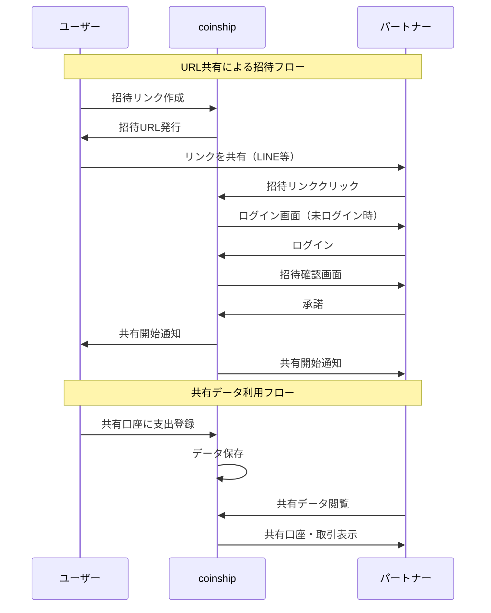
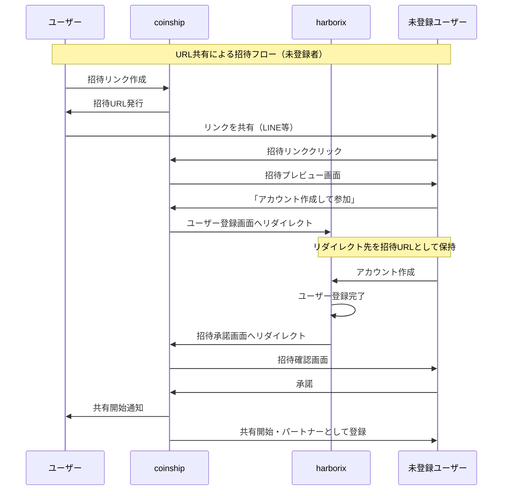

# REQ-002-03: coinship ユースケース

## 概要

coinship（家計簿アプリ）の主要なユースケースを定義する。

## アクター定義

| アクター     | 説明                                       |
| ------------ | ------------------------------------------ |
| ユーザー     | coinshipを利用するユーザー                 |
| パートナー   | 共有相手として招待されたユーザー           |
| 未登録ユーザー | 招待リンク経由でアクセスした未登録の人   |

※認証はharborix基盤のSSOで行う

## ユースケース一覧

### 口座管理系

#### UC-001: 口座登録

| 項目       | 内容                                                                                                                                  |
| ---------- | ------------------------------------------------------------------------------------------------------------------------------------- |
| アクター   | ユーザー                                                                                                                              |
| 事前条件   | ログイン済み                                                                                                                          |
| 基本フロー | 1. 口座管理画面を開く<br>2. 新規登録を選択<br>3. 口座種別（銀行/現金/共有）を選択<br>4. 口座名、初期残高を入力<br>5. 保存ボタンを押す |
| 事後条件   | 新しい口座が登録される                                                                                                                |

#### UC-002: 口座間振替

| 項目       | 内容                                                                                                    |
| ---------- | ------------------------------------------------------------------------------------------------------- |
| アクター   | ユーザー                                                                                                |
| 事前条件   | 2つ以上の口座が登録済み                                                                                 |
| 基本フロー | 1. 振替機能を選択<br>2. 振替元口座を選択<br>3. 振替先口座を選択<br>4. 金額を入力<br>5. 実行ボタンを押す |
| 事後条件   | 両口座の残高が更新される                                                                                |

### 収支記録系

#### UC-003: 支出登録

| 項目       | 内容                                                                                                                                                                                        |
| ---------- | ------------------------------------------------------------------------------------------------------------------------------------------------------------------------------------------- |
| アクター   | ユーザー                                                                                                                                                                                    |
| 事前条件   | 口座が登録済み                                                                                                                                                                              |
| 基本フロー | 1. 取引登録画面を開く<br>2. 支出を選択<br>3. 金額を入力<br>4. カテゴリを選択<br>5. 支払い方法/口座を選択<br>6. 日付を指定（デフォルト今日）<br>7. メモを入力（任意）<br>8. 保存ボタンを押す |
| 代替フロー | 7a. ポイント利用がある場合、ポイント利用額を入力                                                                                                                                            |
| 事後条件   | 支出が記録され、口座残高が減少                                                                                                                                                              |

#### UC-004: 収入登録

| 項目       | 内容                                                                                                                                                                 |
| ---------- | -------------------------------------------------------------------------------------------------------------------------------------------------------------------- |
| アクター   | ユーザー                                                                                                                                                             |
| 事前条件   | 口座が登録済み                                                                                                                                                       |
| 基本フロー | 1. 取引登録画面を開く<br>2. 収入を選択<br>3. 金額を入力<br>4. カテゴリを選択<br>5. 入金先口座を選択<br>6. 日付を指定<br>7. メモを入力（任意）<br>8. 保存ボタンを押す |
| 事後条件   | 収入が記録され、口座残高が増加                                                                                                                                       |

#### UC-005: 取引検索・フィルター

| 項目       | 内容                                                                                                                                       |
| ---------- | ------------------------------------------------------------------------------------------------------------------------------------------ |
| アクター   | ユーザー                                                                                                                                   |
| 事前条件   | 取引が登録済み                                                                                                                             |
| 基本フロー | 1. 取引一覧画面を開く<br>2. 検索条件を入力（キーワード、期間、カテゴリ、口座）<br>3. 検索ボタンを押す<br>4. 条件に合致する取引が表示される |
| 事後条件   | なし                                                                                                                                       |

### パートナー共有系

#### UC-006: パートナー招待（URL共有）

| 項目       | 内容                                                                                                                                                    |
| ---------- | ------------------------------------------------------------------------------------------------------------------------------------------------------- |
| アクター   | ユーザー                                                                                                                                                |
| 事前条件   | パートナー未設定                                                                                                                                        |
| 基本フロー | 1. 共有設定画面を開く<br>2. 「招待リンクを作成」を選択<br>3. 招待リンク（URL）が生成される<br>4. リンクをコピーしてパートナーに共有（LINE、メール等） |
| 事後条件   | 招待リンクが有効になる（ステータス: 招待中）                                                                                                            |

#### UC-007: 招待承諾（既存ユーザー）

| 項目       | 内容                                                                                                                          |
| ---------- | ----------------------------------------------------------------------------------------------------------------------------- |
| アクター   | パートナー                                                                                                                    |
| 事前条件   | harborixアカウントを持っている、招待リンクを受け取っている                                                                    |
| 基本フロー | 1. 招待リンクをクリック<br>2. harborixにログイン（未ログインの場合）<br>3. 招待内容を確認<br>4. 承諾ボタンを押す              |
| 代替フロー | 4a. 拒否を選択した場合、招待がキャンセルされる                                                                                |
| 事後条件   | パートナー共有が有効になる                                                                                                    |

#### UC-007a: 招待承諾（未登録ユーザー）

| 項目       | 内容                                                                                                                                                                                                           |
| ---------- | -------------------------------------------------------------------------------------------------------------------------------------------------------------------------------------------------------------- |
| アクター   | 未登録ユーザー                                                                                                                                                                                                 |
| 事前条件   | harborixアカウントを持っていない、招待リンクを受け取っている                                                                                                                                                   |
| 基本フロー | 1. 招待リンクをクリック<br>2. 招待内容のプレビュー画面が表示される<br>3. 「アカウント作成して参加」を選択<br>4. harborixのユーザー登録画面へ遷移<br>5. アカウント作成・ログイン完了<br>6. 自動的に招待承諾画面へリダイレクト<br>7. 承諾ボタンを押す |
| 代替フロー | 3a. 「既にアカウントをお持ちの方」を選択した場合、ログイン画面へ遷移<br>7a. 拒否を選択した場合、招待がキャンセルされる                                                                                         |
| 事後条件   | 新規アカウントが作成され、パートナー共有が有効になる                                                                                                                                                           |

#### UC-008: 共有口座設定

| 項目       | 内容                                                                  |
| ---------- | --------------------------------------------------------------------- |
| アクター   | ユーザー                                                              |
| 事前条件   | パートナー共有が有効                                                  |
| 基本フロー | 1. 共有設定画面を開く<br>2. 共有する口座を選択<br>3. 保存ボタンを押す |
| 事後条件   | 選択した口座がパートナーに共有される                                  |

### 集計・可視化系

#### UC-009: 月別レポート閲覧

| 項目       | 内容                                                                                            |
| ---------- | ----------------------------------------------------------------------------------------------- |
| アクター   | ユーザー                                                                                        |
| 事前条件   | 取引が登録済み                                                                                  |
| 基本フロー | 1. レポート画面を開く<br>2. 月を選択<br>3. 収入・支出の合計、カテゴリ別内訳、グラフが表示される |
| 事後条件   | なし                                                                                            |

#### UC-010: 残高推移確認

| 項目       | 内容                                                                                           |
| ---------- | ---------------------------------------------------------------------------------------------- |
| アクター   | ユーザー                                                                                       |
| 事前条件   | 口座と取引が登録済み                                                                           |
| 基本フロー | 1. レポート画面を開く<br>2. 残高推移タブを選択<br>3. 期間を指定<br>4. 時系列グラフが表示される |
| 事後条件   | なし                                                                                           |

### PWA系

#### UC-011: オフライン入力

| 項目       | 内容                                                                                         |
| ---------- | -------------------------------------------------------------------------------------------- |
| アクター   | ユーザー                                                                                     |
| 事前条件   | アプリインストール済み、オフライン状態                                                       |
| 基本フロー | 1. アプリを開く<br>2. 取引を入力<br>3. ローカルに保存される<br>4. オンライン復帰時に自動同期 |
| 事後条件   | 取引がローカル保存され、オンライン時に同期                                                   |

## ユースケース図

```mermaid
graph TB
    subgraph アクター
        U[ユーザー]
        P[パートナー]
        N[未登録ユーザー]
    end

    subgraph 口座管理系
        UC001[UC-001: 口座登録]
        UC002[UC-002: 口座間振替]
    end

    subgraph 収支記録系
        UC003[UC-003: 支出登録]
        UC004[UC-004: 収入登録]
        UC005[UC-005: 取引検索]
    end

    subgraph パートナー共有系
        UC006[UC-006: パートナー招待]
        UC007[UC-007: 招待承諾]
        UC007a[UC-007a: 招待承諾_未登録]
        UC008[UC-008: 共有口座設定]
    end

    subgraph 集計・可視化系
        UC009[UC-009: 月別レポート]
        UC010[UC-010: 残高推移]
    end

    subgraph PWA系
        UC011[UC-011: オフライン入力]
    end

    U --> UC001
    U --> UC002
    U --> UC003
    U --> UC004
    U --> UC005
    U --> UC006
    U --> UC008
    U --> UC009
    U --> UC010
    U --> UC011

    P --> UC007
    P --> UC003
    P --> UC004
    P --> UC009

    N --> UC007a
```

## パートナー共有フロー図

### 既存ユーザーの招待フロー



### 未登録ユーザーの招待フロー



## 変更履歴

- 2026-02-11: パートナー招待をURL共有方式に変更、未登録ユーザーのフローを追加
- 2026-02-11: 初版作成
