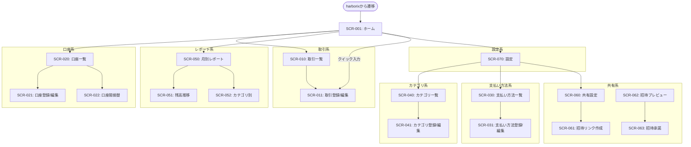

# REQ-002-04: coinship 画面一覧

## 概要

coinship（家計簿アプリ）で必要な画面を定義する。

## 画面一覧

### ホーム画面

| ID | 画面名 | 概要 | URL（案） |
| -- | ------ | ---- | --------- |
| SCR-001 | ホーム/ダッシュボード | 残高サマリー、最近の取引、クイック入力 | / |

### 取引系画面

| ID | 画面名 | 概要 | URL（案） |
| -- | ------ | ---- | --------- |
| SCR-010 | 取引一覧 | 取引履歴の一覧表示、検索、フィルター | /transactions |
| SCR-011 | 取引登録/編集 | 支出・収入の入力フォーム | /transactions/new, /transactions/:id |

### 口座系画面

| ID | 画面名 | 概要 | URL（案） |
| -- | ------ | ---- | --------- |
| SCR-020 | 口座一覧 | 登録口座の一覧、残高表示 | /accounts |
| SCR-021 | 口座登録/編集 | 口座の追加・編集フォーム | /accounts/new, /accounts/:id |
| SCR-022 | 口座間振替 | 振替の入力フォーム | /accounts/transfer |

### 支払い方法系画面

| ID | 画面名 | 概要 | URL（案） |
| -- | ------ | ---- | --------- |
| SCR-030 | 支払い方法一覧 | 登録済み支払い方法の一覧 | /payment-methods |
| SCR-031 | 支払い方法登録/編集 | 支払い方法の追加・編集フォーム | /payment-methods/new, /payment-methods/:id |

### カテゴリ系画面

| ID | 画面名 | 概要 | URL（案） |
| -- | ------ | ---- | --------- |
| SCR-040 | カテゴリ一覧 | 収入・支出カテゴリの一覧 | /categories |
| SCR-041 | カテゴリ登録/編集 | カテゴリの追加・編集フォーム | /categories/new, /categories/:id |

### レポート系画面

| ID | 画面名 | 概要 | URL（案） |
| -- | ------ | ---- | --------- |
| SCR-050 | 月別レポート | 月次の収支サマリー、円グラフ | /reports/monthly |
| SCR-051 | 残高推移 | 時系列での残高変化グラフ | /reports/balance |
| SCR-052 | カテゴリ別レポート | カテゴリごとの集計 | /reports/category |

### 共有系画面

| ID | 画面名 | 概要 | URL（案） |
| -- | ------ | ---- | --------- |
| SCR-060 | 共有設定 | パートナー共有の設定 | /sharing |
| SCR-061 | 招待リンク作成 | 招待URL生成・コピー画面 | /sharing/invite |
| SCR-062 | 招待プレビュー | 未登録ユーザー向け招待内容表示 | /sharing/preview/:token |
| SCR-063 | 招待承諾 | 招待への応答画面 | /sharing/accept/:token |

### 設定系画面

| ID | 画面名 | 概要 | URL（案） |
| -- | ------ | ---- | --------- |
| SCR-070 | 設定 | アプリ設定（通貨、開始日等） | /settings |

## 画面遷移図

## 画面構成要素

### 共通ナビゲーション（ボトムナビ/サイドバー）

| 要素 | 内容 |
| ---- | ---- |
| ホーム | ダッシュボードへ |
| 取引 | 取引一覧へ |
| レポート | レポート画面へ |
| 設定 | 設定画面へ |

### ホーム画面の構成

| 要素 | 内容 |
| ---- | ---- |
| 総残高 | 全口座の合計残高 |
| 口座別残高 | 各口座の残高一覧（タップで口座詳細へ） |
| 今月の収支 | 当月の収入・支出サマリー |
| 最近の取引 | 直近5件程度の取引 |
| クイック入力 | +ボタンで取引登録へ |

## 画面数サマリー

| カテゴリ | 画面数 |
| -------- | ------ |
| ホーム | 1 |
| 取引系 | 2 |
| 口座系 | 3 |
| 支払い方法系 | 2 |
| カテゴリ系 | 2 |
| レポート系 | 3 |
| 共有系 | 4 |
| 設定系 | 1 |
| **合計** | **18** |

## 変更履歴

- 2026-02-11: 共有系をURL共有方式に変更、招待プレビュー画面を追加
- 2026-02-11: 初版作成
