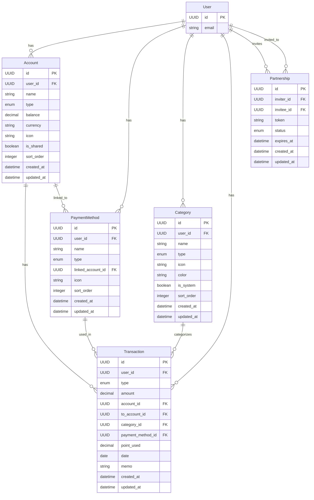

# REQ-002-05: coinship データ一覧

## 概要

coinship（家計簿アプリ）で扱うデータを定義する。

## エンティティ一覧

### 1. 口座（Account）

| 項目 | 内容 |
| ---- | ---- |
| 概要 | ユーザーの銀行口座、現金、共有口座 |
| 主な属性 | ID、ユーザーID、口座名、種別、残高 |

| 属性名 | 型 | 必須 | 説明 |
| ------ | -- | ---- | ---- |
| id | UUID | ○ | 一意識別子 |
| user_id | UUID | ○ | 所有ユーザーID（FK） |
| name | string | ○ | 口座名 |
| type | enum | ○ | 種別（bank/cash/shared） |
| balance | decimal | ○ | 現在残高 |
| currency | string | ○ | 通貨（デフォルト: JPY） |
| icon | string | - | アイコン識別子 |
| is_shared | boolean | ○ | 共有対象フラグ |
| sort_order | integer | ○ | 表示順序 |
| created_at | datetime | ○ | 作成日時 |
| updated_at | datetime | ○ | 更新日時 |

### 2. 支払い方法（PaymentMethod）

| 項目 | 内容 |
| ---- | ---- |
| 概要 | クレカ、電子マネー、QR決済など |
| 主な属性 | ID、ユーザーID、名前、種別、引落口座 |

| 属性名 | 型 | 必須 | 説明 |
| ------ | -- | ---- | ---- |
| id | UUID | ○ | 一意識別子 |
| user_id | UUID | ○ | 所有ユーザーID（FK） |
| name | string | ○ | 支払い方法名 |
| type | enum | ○ | 種別（credit_card/e_money/qr_payment） |
| linked_account_id | UUID | - | 引落口座ID（FK） |
| icon | string | - | アイコン識別子 |
| sort_order | integer | ○ | 表示順序 |
| created_at | datetime | ○ | 作成日時 |
| updated_at | datetime | ○ | 更新日時 |

### 3. カテゴリ（Category）

| 項目 | 内容 |
| ---- | ---- |
| 概要 | 収入・支出のカテゴリ分類 |
| 主な属性 | ID、ユーザーID、名前、種別、アイコン |

| 属性名 | 型 | 必須 | 説明 |
| ------ | -- | ---- | ---- |
| id | UUID | ○ | 一意識別子 |
| user_id | UUID | - | ユーザーID（nullはシステムデフォルト） |
| name | string | ○ | カテゴリ名 |
| type | enum | ○ | 種別（income/expense） |
| icon | string | ○ | アイコン識別子 |
| color | string | - | 表示色 |
| is_system | boolean | ○ | システムデフォルトフラグ |
| sort_order | integer | ○ | 表示順序 |
| created_at | datetime | ○ | 作成日時 |
| updated_at | datetime | ○ | 更新日時 |

### 4. 取引（Transaction）

| 項目 | 内容 |
| ---- | ---- |
| 概要 | 収入・支出・振替の記録 |
| 主な属性 | ID、ユーザーID、種別、金額、口座、カテゴリ |

| 属性名 | 型 | 必須 | 説明 |
| ------ | -- | ---- | ---- |
| id | UUID | ○ | 一意識別子 |
| user_id | UUID | ○ | 所有ユーザーID（FK） |
| type | enum | ○ | 種別（income/expense/transfer） |
| amount | decimal | ○ | 金額 |
| account_id | UUID | ○ | 口座ID（FK） |
| to_account_id | UUID | - | 振替先口座ID（振替時のみ） |
| category_id | UUID | - | カテゴリID（FK） |
| payment_method_id | UUID | - | 支払い方法ID（FK） |
| point_used | decimal | - | ポイント利用額 |
| date | date | ○ | 取引日 |
| memo | string | - | メモ |
| created_at | datetime | ○ | 作成日時 |
| updated_at | datetime | ○ | 更新日時 |

### 5. パートナーシップ（Partnership）

| 項目 | 内容 |
| ---- | ---- |
| 概要 | ユーザー間の共有関係（URL共有方式） |
| 主な属性 | ID、招待者ID、被招待者ID、トークン、ステータス |

| 属性名 | 型 | 必須 | 説明 |
| ------ | -- | ---- | ---- |
| id | UUID | ○ | 一意識別子 |
| inviter_id | UUID | ○ | 招待者ユーザーID（FK） |
| invitee_id | UUID | - | 被招待者ユーザーID（FK、承諾後に設定） |
| token | string | ○ | 招待トークン（URL識別子） |
| status | enum | ○ | ステータス（pending/accepted/rejected） |
| expires_at | datetime | ○ | 招待有効期限 |
| created_at | datetime | ○ | 作成日時 |
| updated_at | datetime | ○ | 更新日時 |

## ER図

## リレーション

| 関係 | 説明 |
| ---- | ---- |
| User : Account | 1 : N（1ユーザーは複数の口座を持つ） |
| User : PaymentMethod | 1 : N（1ユーザーは複数の支払い方法を持つ） |
| User : Category | 1 : N（1ユーザーは複数のカテゴリを持つ） |
| User : Transaction | 1 : N（1ユーザーは複数の取引を持つ） |
| Account : Transaction | 1 : N（1口座は複数の取引を持つ） |
| Category : Transaction | 1 : N（1カテゴリは複数の取引を持つ） |
| PaymentMethod : Transaction | 1 : N（1支払い方法は複数の取引を持つ） |
| Account : PaymentMethod | 1 : N（1口座は複数の支払い方法の引落先になれる） |
| User : Partnership | 1 : N（1ユーザーは複数のパートナーシップを持てる） |

## デフォルトカテゴリ案

### 支出カテゴリ

| カテゴリ名 | アイコン |
| ---------- | -------- |
| 食費 | 🍚 |
| 日用品 | 🧴 |
| 交通費 | 🚃 |
| 住居費 | 🏠 |
| 水道光熱 | 💡 |
| 通信費 | 📱 |
| 医療費 | 🏥 |
| 娯楽 | 🎮 |
| 衣服 | 👕 |
| 美容 | 💇 |
| 交際費 | 🎉 |
| その他 | 📦 |

### 収入カテゴリ

| カテゴリ名 | アイコン |
| ---------- | -------- |
| 給与 | 💰 |
| 副業 | 💼 |
| 投資 | 📈 |
| その他 | 📦 |

## データ量見積もり

| エンティティ | 想定レコード数 | 備考 |
| ------------ | -------------- | ---- |
| Account | 〜50/ユーザー | 口座数は限定的 |
| PaymentMethod | 〜20/ユーザー | 支払い方法数は限定的 |
| Category | 〜30/ユーザー | デフォルト+カスタム |
| Transaction | 〜10,000/ユーザー/年 | 1日平均30件程度 |
| Partnership | 〜5/ユーザー | パートナー数は限定的 |

## 変更履歴

- 2026-02-11: パートナーシップをURL共有方式に変更（invitee_emailを削除）
- 2026-02-11: 初版作成
