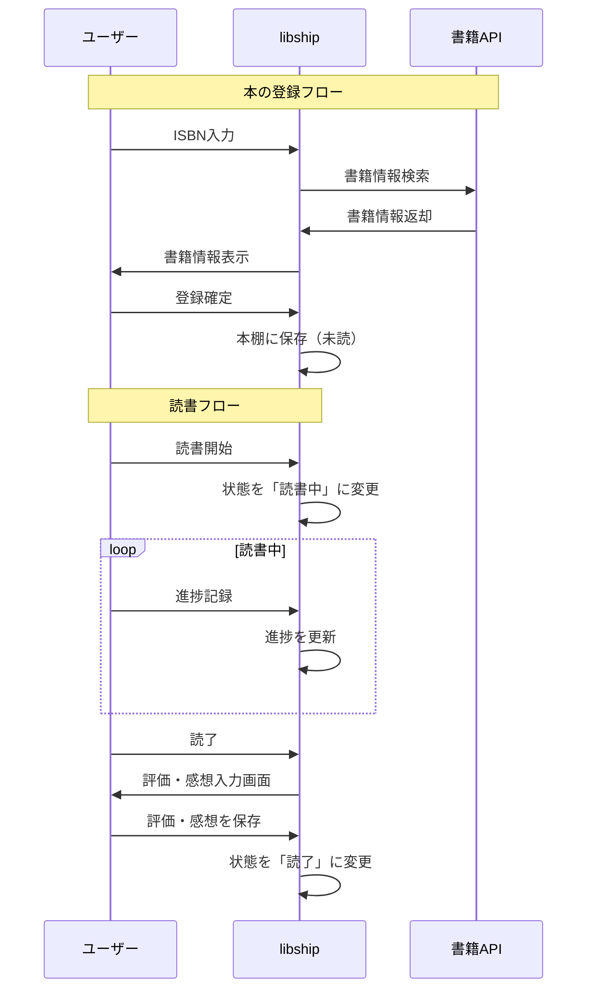

# REQ-003-03: libship ユースケース

## 概要

libship（読書管理アプリ）の主要なユースケースを定義する。

## アクター定義

| アクター | 説明                      |
| -------- | ------------------------- |
| ユーザー | libshipを利用するユーザー |

※認証はharborix基盤のSSOで行うため、未認証ユーザーのユースケースは省略

## ユースケース一覧

### 本の登録系

#### UC-001: ISBN検索で本を登録

| 項目       | 内容                                                                                                                                                                         |
| ---------- | ---------------------------------------------------------------------------------------------------------------------------------------------------------------------------- |
| アクター   | ユーザー                                                                                                                                                                     |
| 事前条件   | ログイン済み                                                                                                                                                                 |
| 基本フロー | 1. 本の登録画面を開く<br>2. ISBN検索タブを選択<br>3. ISBNを入力またはバーコードをスキャン<br>4. 書籍情報が自動取得される<br>5. 必要に応じて情報を編集<br>6. 保存ボタンを押す |
| 代替フロー | 4a. 書籍が見つからない場合、手動登録に切り替え                                                                                                                               |
| 事後条件   | 本が本棚に登録される                                                                                                                                                         |

#### UC-002: 手動で本を登録

| 項目       | 内容                                                                                                                                            |
| ---------- | ----------------------------------------------------------------------------------------------------------------------------------------------- |
| アクター   | ユーザー                                                                                                                                        |
| 事前条件   | ログイン済み                                                                                                                                    |
| 基本フロー | 1. 本の登録画面を開く<br>2. 手動登録タブを選択<br>3. タイトル、著者、出版社等を入力<br>4. 表紙画像をアップロード（任意）<br>5. 保存ボタンを押す |
| 事後条件   | 本が本棚に登録される（状態: 未読）                                                                                                              |

### 読書記録系

#### UC-003: 読書を開始する

| 項目       | 内容                                                                                                                            |
| ---------- | ------------------------------------------------------------------------------------------------------------------------------- |
| アクター   | ユーザー                                                                                                                        |
| 事前条件   | 本が登録済み                                                                                                                    |
| 基本フロー | 1. 本棚から本を選択<br>2. 本の詳細画面を開く<br>3. 「読書開始」ボタンを押す<br>4. 開始日を確認（デフォルト今日）<br>5. 確定する |
| 事後条件   | 状態が「読書中」に変更される                                                                                                    |

#### UC-004: 読書進捗を記録する

| 項目       | 内容                                                                                         |
| ---------- | -------------------------------------------------------------------------------------------- |
| アクター   | ユーザー                                                                                     |
| 事前条件   | 読書中の本がある                                                                             |
| 基本フロー | 1. 読書中の本を選択<br>2. 進捗記録を開く<br>3. 現在のページ数または割合を入力<br>4. 保存する |
| 事後条件   | 進捗が更新される                                                                             |

#### UC-005: 読了を記録する

| 項目       | 内容                                                                                                                                                     |
| ---------- | -------------------------------------------------------------------------------------------------------------------------------------------------------- |
| アクター   | ユーザー                                                                                                                                                 |
| 事前条件   | 読書中の本がある                                                                                                                                         |
| 基本フロー | 1. 読書中の本を選択<br>2. 「読了」ボタンを押す<br>3. 終了日を確認（デフォルト今日）<br>4. 評価を入力（1〜5段階）<br>5. 感想を入力（任意）<br>6. 確定する |
| 事後条件   | 状態が「読了」に変更、評価と感想が保存される                                                                                                             |

### 感想・評価系

#### UC-006: 感想を書く

| 項目       | 内容                                                                                 |
| ---------- | ------------------------------------------------------------------------------------ |
| アクター   | ユーザー                                                                             |
| 事前条件   | 本が登録済み                                                                         |
| 基本フロー | 1. 本の詳細画面を開く<br>2. 感想タブを選択<br>3. 感想を自由記述で入力<br>4. 保存する |
| 事後条件   | 感想が保存される                                                                     |

#### UC-007: 引用をメモする

| 項目       | 内容                                                                                                                |
| ---------- | ------------------------------------------------------------------------------------------------------------------- |
| アクター   | ユーザー                                                                                                            |
| 事前条件   | 本が登録済み                                                                                                        |
| 基本フロー | 1. 本の詳細画面を開く<br>2. 引用タブを選択<br>3. 「引用を追加」を押す<br>4. 引用箇所、ページ数を入力<br>5. 保存する |
| 事後条件   | 引用がメモとして保存される                                                                                          |

### 本棚管理系

#### UC-008: 本を検索する

| 項目       | 内容                                                                        |
| ---------- | --------------------------------------------------------------------------- |
| アクター   | ユーザー                                                                    |
| 事前条件   | 本が登録済み                                                                |
| 基本フロー | 1. 本棚画面を開く<br>2. 検索欄にキーワードを入力<br>3. 検索結果が表示される |
| 事後条件   | なし                                                                        |

#### UC-009: カテゴリで絞り込む

| 項目       | 内容                                                                                       |
| ---------- | ------------------------------------------------------------------------------------------ |
| アクター   | ユーザー                                                                                   |
| 事前条件   | 本とカテゴリが登録済み                                                                     |
| 基本フロー | 1. 本棚画面を開く<br>2. フィルターを開く<br>3. カテゴリを選択<br>4. 該当する本が表示される |
| 事後条件   | なし                                                                                       |

### 統計系

#### UC-010: 読書統計を見る

| 項目       | 内容                                                                                   |
| ---------- | -------------------------------------------------------------------------------------- |
| アクター   | ユーザー                                                                               |
| 事前条件   | 読了本がある                                                                           |
| 基本フロー | 1. 統計画面を開く<br>2. 期間を選択（月/年）<br>3. 読了数、ジャンル別グラフが表示される |
| 事後条件   | なし                                                                                   |

## ユースケース図

```mermaid
graph TB
    subgraph アクター
        U[ユーザー]
    end

    subgraph 本の登録系
        UC001[UC-001: ISBN検索登録]
        UC002[UC-002: 手動登録]
    end

    subgraph 読書記録系
        UC003[UC-003: 読書開始]
        UC004[UC-004: 進捗記録]
        UC005[UC-005: 読了記録]
    end

    subgraph 感想・評価系
        UC006[UC-006: 感想を書く]
        UC007[UC-007: 引用メモ]
    end

    subgraph 本棚管理系
        UC008[UC-008: 本を検索]
        UC009[UC-009: カテゴリ絞込]
    end

    subgraph 統計系
        UC010[UC-010: 読書統計]
    end

    U --> UC001
    U --> UC002
    U --> UC003
    U --> UC004
    U --> UC005
    U --> UC006
    U --> UC007
    U --> UC008
    U --> UC009
    U --> UC010
```

## 読書フロー図



## 変更履歴

- 2026-02-11: 初版作成
