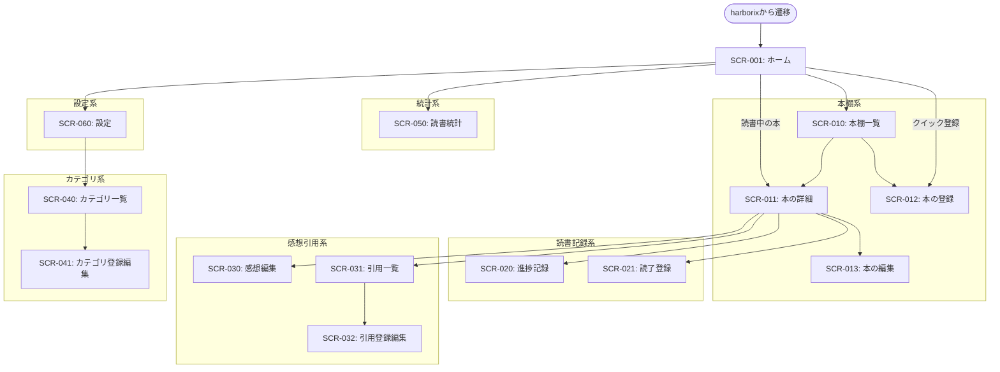

# REQ-003-04: libship 画面一覧

## 概要

libship（読書管理アプリ）で必要な画面を定義する。

## 画面一覧

### ホーム画面

| ID | 画面名 | 概要 | URL（案） |
| -- | ------ | ---- | --------- |
| SCR-001 | ホーム/ダッシュボード | 読書中の本、最近の読了、統計サマリー | / |

### 本棚系画面

| ID | 画面名 | 概要 | URL（案） |
| -- | ------ | ---- | --------- |
| SCR-010 | 本棚一覧 | 登録した本の一覧、検索、フィルター | /books |
| SCR-011 | 本の詳細 | 本の情報、読書記録、感想、引用 | /books/:id |
| SCR-012 | 本の登録 | ISBN検索/手動登録フォーム | /books/new |
| SCR-013 | 本の編集 | 本の情報編集フォーム | /books/:id/edit |

### 読書記録系画面

| ID | 画面名 | 概要 | URL（案） |
| -- | ------ | ---- | --------- |
| SCR-020 | 進捗記録 | 現在のページ/割合を記録 | /books/:id/progress |
| SCR-021 | 読了登録 | 評価、感想の入力フォーム | /books/:id/complete |

### 感想・引用系画面

| ID | 画面名 | 概要 | URL（案） |
| -- | ------ | ---- | --------- |
| SCR-030 | 感想編集 | 感想の入力・編集フォーム | /books/:id/review |
| SCR-031 | 引用一覧 | 本の引用メモ一覧 | /books/:id/quotes |
| SCR-032 | 引用登録/編集 | 引用の追加・編集フォーム | /books/:id/quotes/new, /books/:id/quotes/:qid |

### カテゴリ系画面

| ID | 画面名 | 概要 | URL（案） |
| -- | ------ | ---- | --------- |
| SCR-040 | カテゴリ一覧 | 登録済みカテゴリの一覧 | /categories |
| SCR-041 | カテゴリ登録/編集 | カテゴリの追加・編集フォーム | /categories/new, /categories/:id |

### 統計系画面

| ID | 画面名 | 概要 | URL（案） |
| -- | ------ | ---- | --------- |
| SCR-050 | 読書統計 | 読了数推移、カテゴリ別グラフ | /stats |

### 設定系画面

| ID | 画面名 | 概要 | URL（案） |
| -- | ------ | ---- | --------- |
| SCR-060 | 設定 | アプリ設定 | /settings |

## 画面遷移図

## 画面構成要素

### 共通ナビゲーション（ボトムナビ/サイドバー）

| 要素 | 内容 |
| ---- | ---- |
| ホーム | ダッシュボードへ |
| 本棚 | 本棚一覧へ |
| 統計 | 読書統計へ |
| 設定 | 設定画面へ |

### ホーム画面の構成

| 要素 | 内容 |
| ---- | ---- |
| 読書中の本 | 現在読んでいる本（最大3冊程度） |
| 今月の読了 | 今月読み終わった本の数 |
| 最近の読了 | 直近に読了した本 |
| クイック登録 | +ボタンで本の登録へ |

### 本の詳細画面の構成

| 要素 | 内容 |
| ---- | ---- |
| 書籍情報 | タイトル、著者、出版社、表紙 |
| 読書状態 | 未読/読書中/読了、進捗 |
| 評価 | 星評価（読了時） |
| 感想タブ | 感想メモの表示・編集 |
| 引用タブ | 引用メモの一覧・追加 |

## 画面数サマリー

| カテゴリ | 画面数 |
| -------- | ------ |
| ホーム | 1 |
| 本棚系 | 4 |
| 読書記録系 | 2 |
| 感想・引用系 | 3 |
| カテゴリ系 | 2 |
| 統計系 | 1 |
| 設定系 | 1 |
| **合計** | **14** |

## 変更履歴

- 2026-02-11: 初版作成
