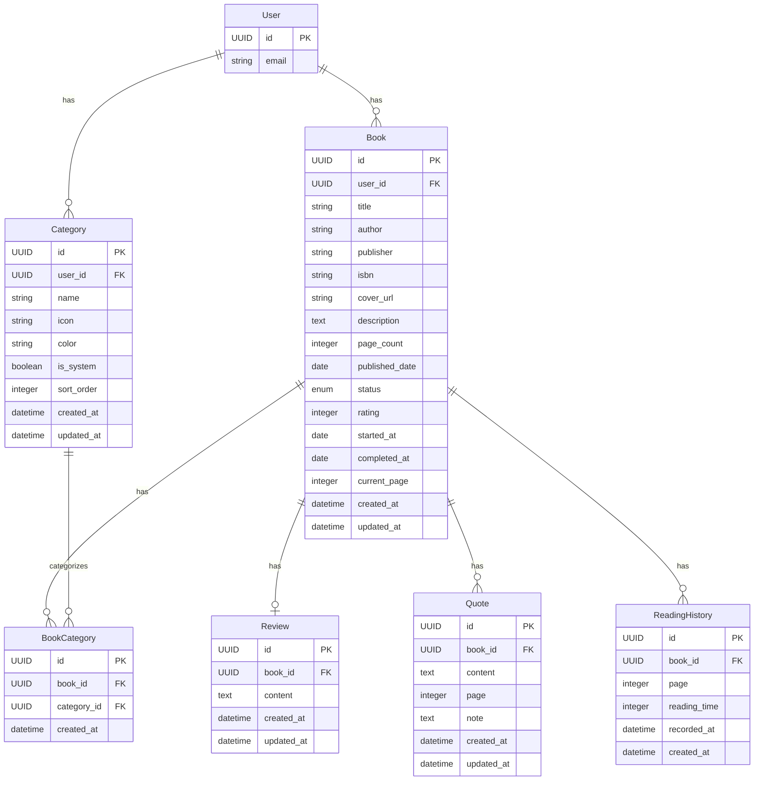

# REQ-003-05: libship データ一覧

## 概要

libship（読書管理アプリ）で扱うデータを定義する。

## エンティティ一覧

### 1. 本（Book）

| 項目 | 内容 |
| ---- | ---- |
| 概要 | ユーザーが登録した本 |
| 主な属性 | ID、ユーザーID、タイトル、著者、ISBN、状態 |

| 属性名 | 型 | 必須 | 説明 |
| ------ | -- | ---- | ---- |
| id | UUID | ○ | 一意識別子 |
| user_id | UUID | ○ | 所有ユーザーID（FK） |
| title | string | ○ | 書籍タイトル |
| author | string | - | 著者名 |
| publisher | string | - | 出版社 |
| isbn | string | - | ISBN（13桁または10桁） |
| cover_url | string | - | 表紙画像URL |
| description | text | - | 書籍説明 |
| page_count | integer | - | 総ページ数 |
| published_date | date | - | 出版日 |
| status | enum | ○ | 読書状態（unread/reading/completed） |
| rating | integer | - | 評価（1〜5） |
| started_at | date | - | 読書開始日 |
| completed_at | date | - | 読了日 |
| current_page | integer | - | 現在のページ数 |
| created_at | datetime | ○ | 作成日時 |
| updated_at | datetime | ○ | 更新日時 |

### 2. カテゴリ（Category）

| 項目 | 内容 |
| ---- | ---- |
| 概要 | 本のジャンル・タグ分類 |
| 主な属性 | ID、ユーザーID、名前、アイコン |

| 属性名 | 型 | 必須 | 説明 |
| ------ | -- | ---- | ---- |
| id | UUID | ○ | 一意識別子 |
| user_id | UUID | - | ユーザーID（nullはシステムデフォルト） |
| name | string | ○ | カテゴリ名 |
| icon | string | - | アイコン識別子 |
| color | string | - | 表示色 |
| is_system | boolean | ○ | システムデフォルトフラグ |
| sort_order | integer | ○ | 表示順序 |
| created_at | datetime | ○ | 作成日時 |
| updated_at | datetime | ○ | 更新日時 |

### 3. 本カテゴリ紐付け（BookCategory）

| 項目 | 内容 |
| ---- | ---- |
| 概要 | 本とカテゴリの多対多関係 |
| 主な属性 | 本ID、カテゴリID |

| 属性名 | 型 | 必須 | 説明 |
| ------ | -- | ---- | ---- |
| id | UUID | ○ | 一意識別子 |
| book_id | UUID | ○ | 本ID（FK） |
| category_id | UUID | ○ | カテゴリID（FK） |
| created_at | datetime | ○ | 作成日時 |

### 4. 感想（Review）

| 項目 | 内容 |
| ---- | ---- |
| 概要 | 本の感想メモ |
| 主な属性 | ID、本ID、感想本文 |

| 属性名 | 型 | 必須 | 説明 |
| ------ | -- | ---- | ---- |
| id | UUID | ○ | 一意識別子 |
| book_id | UUID | ○ | 本ID（FK） |
| content | text | ○ | 感想本文 |
| created_at | datetime | ○ | 作成日時 |
| updated_at | datetime | ○ | 更新日時 |

### 5. 引用（Quote）

| 項目 | 内容 |
| ---- | ---- |
| 概要 | 本からの引用メモ |
| 主な属性 | ID、本ID、引用テキスト、ページ |

| 属性名 | 型 | 必須 | 説明 |
| ------ | -- | ---- | ---- |
| id | UUID | ○ | 一意識別子 |
| book_id | UUID | ○ | 本ID（FK） |
| content | text | ○ | 引用テキスト |
| page | integer | - | ページ番号 |
| note | text | - | メモ・コメント |
| created_at | datetime | ○ | 作成日時 |
| updated_at | datetime | ○ | 更新日時 |

### 6. 読書履歴（ReadingHistory）

| 項目 | 内容 |
| ---- | ---- |
| 概要 | 読書進捗の履歴記録 |
| 主な属性 | ID、本ID、ページ、記録日時 |

| 属性名 | 型 | 必須 | 説明 |
| ------ | -- | ---- | ---- |
| id | UUID | ○ | 一意識別子 |
| book_id | UUID | ○ | 本ID（FK） |
| page | integer | ○ | 記録時のページ数 |
| reading_time | integer | - | 読書時間（分） |
| recorded_at | datetime | ○ | 記録日時 |
| created_at | datetime | ○ | 作成日時 |

## ER図

## リレーション

| 関係 | 説明 |
| ---- | ---- |
| User : Book | 1 : N（1ユーザーは複数の本を持つ） |
| User : Category | 1 : N（1ユーザーは複数のカテゴリを持つ） |
| Book : BookCategory | 1 : N（1冊の本は複数のカテゴリに属せる） |
| Category : BookCategory | 1 : N（1カテゴリには複数の本が属する） |
| Book : Review | 1 : 0..1（1冊の本に1つの感想） |
| Book : Quote | 1 : N（1冊の本に複数の引用） |
| Book : ReadingHistory | 1 : N（1冊の本に複数の読書履歴） |

## デフォルトカテゴリ案

| カテゴリ名 | アイコン |
| ---------- | -------- |
| 小説 | 📖 |
| ビジネス | 💼 |
| 技術書 | 💻 |
| 自己啓発 | 🌱 |
| エッセイ | ✍️ |
| 漫画 | 📚 |
| 雑誌 | 📰 |
| その他 | 📦 |

## データ量見積もり

| エンティティ | 想定レコード数 | 備考 |
| ------------ | -------------- | ---- |
| Book | 〜500/ユーザー | 蔵書数は限定的 |
| Category | 〜20/ユーザー | デフォルト+カスタム |
| BookCategory | 〜1,000/ユーザー | Book × 平均2カテゴリ |
| Review | 〜500/ユーザー | 本の数と同程度 |
| Quote | 〜2,000/ユーザー | 本1冊あたり平均4引用 |
| ReadingHistory | 〜5,000/ユーザー | 進捗記録の頻度による |

## 変更履歴

- 2026-02-11: 初版作成
