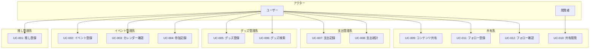
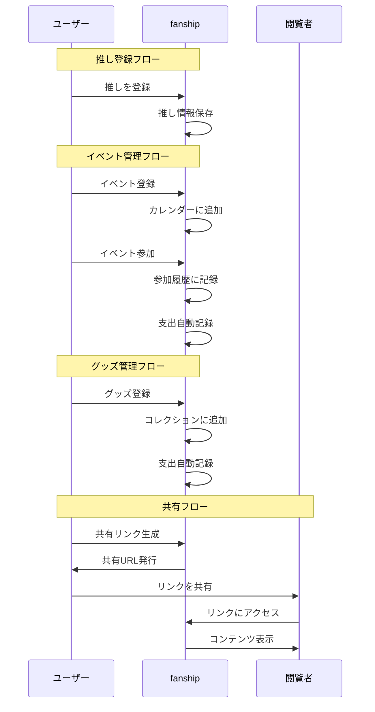
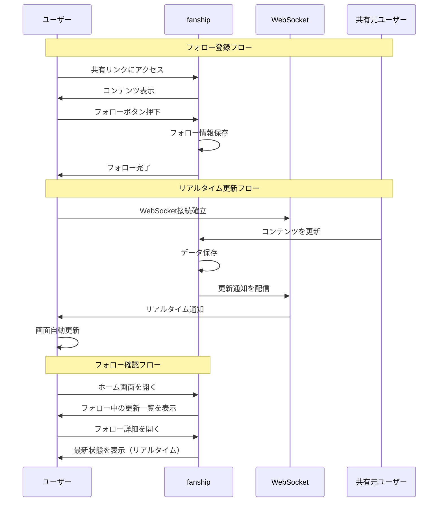

# REQ-004-03: fanship ユースケース

## 概要

fanship（推し活管理アプリ）の主要なユースケースを定義する。

## アクター定義

| アクター | 説明 |
| -------- | ---- |
| ユーザー | fanshipを利用するユーザー |
| 閲覧者 | 共有リンク経由でコンテンツを閲覧する人 |

※認証はharborix基盤のSSOで行うため、未認証ユーザーのユースケースは省略

## ユースケース一覧

### 推し管理系

#### UC-001: 推しを登録する

| 項目 | 内容 |
| ---- | ---- |
| アクター | ユーザー |
| 事前条件 | ログイン済み |
| 基本フロー | 1. 推し管理画面を開く 2. 新規登録を選択 3. 名前、ジャンルを入力 4. プロフィール画像をアップロード（任意） 5. メモを入力（任意） 6. 保存ボタンを押す |
| 事後条件 | 推しが登録される |

#### UC-001a: 推しを一括登録する

| 項目 | 内容 |
| ---- | ---- |
| アクター | ユーザー |
| 事前条件 | ログイン済み |
| 基本フロー | 1. 推し管理画面を開く 2. 「一括登録」を選択 3. 共通のジャンルを選択（任意） 4. 「+行を追加」で入力行を追加 5. 各行に名前を入力 6. 「一括保存」ボタンを押す |
| 代替フロー | 4a. 不要な行は削除ボタンで削除 |
| 事後条件 | 複数の推しがまとめて登録される |

### イベント管理系

#### UC-002: イベントを登録する

| 項目 | 内容 |
| ---- | ---- |
| アクター | ユーザー |
| 事前条件 | 推しが登録済み |
| 基本フロー | 1. イベント登録画面を開く 2. 対象の推しを選択 3. イベント名、種類を入力 4. 日時、場所を入力 5. チケット情報を入力（任意） 6. 保存ボタンを押す |
| 事後条件 | イベントがカレンダーに登録される |

#### UC-003: カレンダーでイベントを確認する

| 項目 | 内容 |
| ---- | ---- |
| アクター | ユーザー |
| 事前条件 | イベントが登録済み |
| 基本フロー | 1. カレンダー画面を開く 2. 月/週表示を切り替え 3. 日付をタップしてイベント詳細を確認 |
| 事後条件 | なし |

#### UC-004: イベント参加を記録する

| 項目 | 内容 |
| ---- | ---- |
| アクター | ユーザー |
| 事前条件 | イベントが登録済み |
| 基本フロー | 1. イベント詳細を開く 2. 「参加済み」にステータス変更 3. 感想メモを入力（任意） 4. 保存する |
| 事後条件 | 参加履歴として記録される |

### グッズ管理系

#### UC-005: グッズを登録する

| 項目 | 内容 |
| ---- | ---- |
| アクター | ユーザー |
| 事前条件 | 推しが登録済み |
| 基本フロー | 1. グッズ登録画面を開く 2. 対象の推しを選択 3. グッズ名、種類を入力 4. 購入日、金額を入力（任意） 5. 画像をアップロード（任意） 6. 保存ボタンを押す |
| 事後条件 | グッズがコレクションに登録される |

#### UC-005a: グッズを一括登録する

| 項目 | 内容 |
| ---- | ---- |
| アクター | ユーザー |
| 事前条件 | 推しが登録済み |
| 基本フロー | 1. グッズ一覧画面を開く 2. 「一括登録」を選択 3. 共通の推し・種類を選択（任意） 4. 「+行を追加」で入力行を追加 5. 各行にグッズ名、金額等を入力 6. 「一括保存」ボタンを押す |
| 代替フロー | 4a. 不要な行は削除ボタンで削除 5a. 共通設定と異なる推し・種類は行ごとに上書き可能 |
| 事後条件 | 複数のグッズがまとめて登録される |

#### UC-006: グッズを検索・絞り込む

| 項目 | 内容 |
| ---- | ---- |
| アクター | ユーザー |
| 事前条件 | グッズが登録済み |
| 基本フロー | 1. グッズ一覧画面を開く 2. 検索キーワードを入力、または 3. 推し別/種類別フィルターを選択 4. 該当するグッズが表示される |
| 事後条件 | なし |

### 支出管理系

#### UC-007: 支出を記録する

| 項目 | 内容 |
| ---- | ---- |
| アクター | ユーザー |
| 事前条件 | ログイン済み |
| 基本フロー | 1. 支出登録画面を開く 2. 対象の推しを選択（任意） 3. カテゴリを選択（グッズ、イベント、交通費等） 4. 金額を入力 5. 日付を指定 6. メモを入力（任意） 7. 保存ボタンを押す |
| 代替フロー | 5a. グッズ/イベント登録時に自動で支出登録 |
| 事後条件 | 支出が記録される |

#### UC-008: 支出統計を確認する

| 項目 | 内容 |
| ---- | ---- |
| アクター | ユーザー |
| 事前条件 | 支出が登録済み |
| 基本フロー | 1. 統計画面を開く 2. 期間を選択（月/年） 3. 推し別/カテゴリ別の集計が表示される 4. グラフで内訳を確認 |
| 事後条件 | なし |

### 共有系

#### UC-009: コンテンツを共有する

| 項目 | 内容 |
| ---- | ---- |
| アクター | ユーザー |
| 事前条件 | 推し/イベント/グッズが登録済み |
| 基本フロー | 1. 共有したいコンテンツを選択 2. 共有ボタンを押す 3. 公開範囲を設定（リンクを知っている人のみ等） 4. 共有リンクが生成される 5. リンクをコピー/SNSにシェア |
| 事後条件 | 共有リンクが有効になる |

#### UC-010: 共有コンテンツを閲覧する

| 項目 | 内容 |
| ---- | ---- |
| アクター | 閲覧者 |
| 事前条件 | 共有リンクを取得済み |
| 基本フロー | 1. 共有リンクにアクセス 2. コンテンツが表示される |
| 事後条件 | なし |

#### UC-011: 共有コンテンツをフォローする

| 項目 | 内容 |
| ---- | ---- |
| アクター | ユーザー |
| 事前条件 | 共有リンクにアクセス済み、ログイン済み |
| 基本フロー | 1. 共有コンテンツを閲覧 2. 「フォロー」ボタンを押す 3. フォロー一覧に追加される |
| 事後条件 | フォロー中のコンテンツとして登録される |

#### UC-012: フォロー中のコンテンツを確認する

| 項目 | 内容 |
| ---- | ---- |
| アクター | ユーザー |
| 事前条件 | フォロー中のコンテンツがある |
| 基本フロー | 1. ホーム画面でフォロー中の更新を確認 2. または、フォロー一覧画面を開く 3. フォロー中のコンテンツが表示される（リアルタイム更新） |
| 代替フロー | 3a. 共有元で更新があった場合、自動的に反映される |
| 事後条件 | なし |

## ユースケース図

## 推し活フロー図

## フォロー・リアルタイム更新フロー図

## 変更履歴

- 2026-02-11: フォロー機能、リアルタイム更新フローを追加
- 2026-02-11: 初版作成
