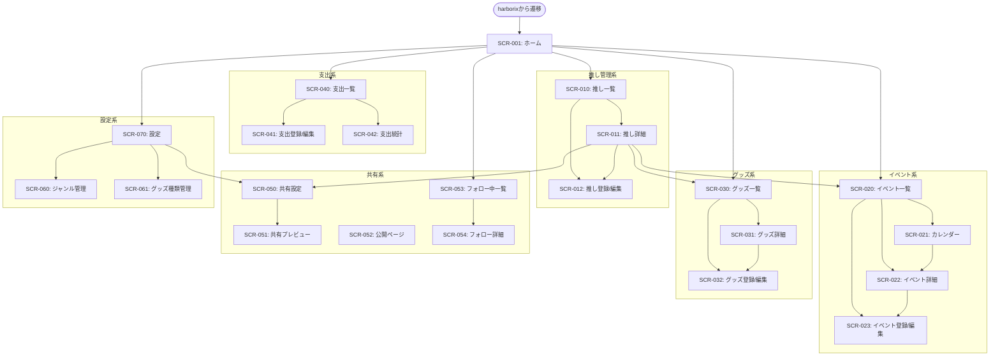

# REQ-004-04: fanship 画面一覧

## 概要

fanship（推し活管理アプリ）で必要な画面を定義する。

## 画面一覧

### ホーム画面

| ID      | 画面名                | 概要                                 | URL（案） |
| ------- | --------------------- | ------------------------------------ | --------- |
| SCR-001 | ホーム/ダッシュボード | 推し一覧、直近イベント、支出サマリー | /         |

### 推し管理系画面

| ID      | 画面名        | 概要                                 | URL（案）                 |
| ------- | ------------- | ------------------------------------ | ------------------------- |
| SCR-010 | 推し一覧      | 登録した推しの一覧                   | /oshi                     |
| SCR-011 | 推し詳細      | 推しの詳細情報、関連イベント・グッズ | /oshi/:id                 |
| SCR-012 | 推し登録/編集 | 推しの追加・編集フォーム             | /oshi/new, /oshi/:id/edit |
| SCR-013 | 推し一括登録  | 複数の推しを一度に登録するフォーム   | /oshi/bulk                |

### イベント系画面

| ID      | 画面名             | 概要                         | URL（案）                     |
| ------- | ------------------ | ---------------------------- | ----------------------------- |
| SCR-020 | イベント一覧       | 登録イベントの一覧表示       | /events                       |
| SCR-021 | イベントカレンダー | カレンダー形式での予定表示   | /events/calendar              |
| SCR-022 | イベント詳細       | イベントの詳細情報           | /events/:id                   |
| SCR-023 | イベント登録/編集  | イベントの追加・編集フォーム | /events/new, /events/:id/edit |

### グッズ系画面

| ID      | 画面名          | 概要                               | URL（案）                   |
| ------- | --------------- | ---------------------------------- | --------------------------- |
| SCR-030 | グッズ一覧      | 所持グッズの一覧表示               | /goods                      |
| SCR-031 | グッズ詳細      | グッズの詳細情報                   | /goods/:id                  |
| SCR-032 | グッズ登録/編集 | グッズの追加・編集フォーム         | /goods/new, /goods/:id/edit |
| SCR-033 | グッズ一括登録  | 複数のグッズを一度に登録するフォーム | /goods/bulk                 |

### 支出系画面

| ID      | 画面名        | 概要                           | URL（案）                         |
| ------- | ------------- | ------------------------------ | --------------------------------- |
| SCR-040 | 支出一覧      | 推し活支出の一覧表示           | /expenses                         |
| SCR-041 | 支出登録/編集 | 支出の追加・編集フォーム       | /expenses/new, /expenses/:id/edit |
| SCR-042 | 支出統計      | 月別・推し別・カテゴリ別グラフ | /expenses/stats                   |

### 共有系画面

| ID      | 画面名         | 概要                                           | URL（案）                |
| ------- | -------------- | ---------------------------------------------- | ------------------------ |
| SCR-050 | 共有設定       | 共有リンクの管理                               | /share                   |
| SCR-051 | 共有プレビュー | 共有前のプレビュー                             | /share/preview/:type/:id |
| SCR-052 | 公開ページ     | 共有リンク先の公開ページ                       | /p/:shareId              |
| SCR-053 | フォロー中一覧 | フォローした共有コンテンツの一覧               | /following               |
| SCR-054 | フォロー詳細   | フォロー中コンテンツの詳細（リアルタイム更新） | /following/:id           |

### カテゴリ系画面

| ID      | 画面名         | 概要                     | URL（案）             |
| ------- | -------------- | ------------------------ | --------------------- |
| SCR-060 | ジャンル管理   | 推しジャンルの一覧・編集 | /settings/genres      |
| SCR-061 | グッズ種類管理 | グッズ種類の一覧・編集   | /settings/goods-types |

### 設定系画面

| ID      | 画面名 | 概要       | URL（案） |
| ------- | ------ | ---------- | --------- |
| SCR-070 | 設定   | アプリ設定 | /settings |

## 画面遷移図

## 画面構成要素

### 共通ナビゲーション（ボトムナビ/サイドバー）

| 要素     | 内容             |
| -------- | ---------------- |
| ホーム   | ダッシュボードへ |
| 推し     | 推し一覧へ       |
| イベント | イベント一覧へ   |
| グッズ   | グッズ一覧へ     |
| 設定     | 設定画面へ       |

### ホーム画面の構成

| 要素             | 内容                                                     |
| ---------------- | -------------------------------------------------------- |
| 推しカード       | 登録した推しのサムネイル一覧                             |
| 直近イベント     | 今後1週間のイベント                                      |
| 今月の支出       | 当月の推し活費用合計                                     |
| 最近追加         | 直近に登録したグッズ                                     |
| フォロー中の更新 | フォローした共有コンテンツの最新更新（リアルタイム反映） |

### 推し詳細画面の構成

| 要素         | 内容                           |
| ------------ | ------------------------------ |
| プロフィール | 名前、画像、ジャンル           |
| イベント     | この推しに関連するイベント一覧 |
| グッズ       | この推しのグッズ一覧           |
| 支出合計     | この推しにかけた総額           |
| 共有ボタン   | プロフィールの共有             |

### イベント詳細画面の構成

| 要素         | 内容                   |
| ------------ | ---------------------- |
| 基本情報     | イベント名、日時、場所 |
| チケット情報 | 座席、枚数、金額       |
| ステータス   | 予定/参加済み          |
| メモ         | 感想等の自由記述       |
| 共有ボタン   | イベントの共有         |

### フォロー詳細画面の構成

| 要素           | 内容                                       |
| -------------- | ------------------------------------------ |
| コンテンツ情報 | 共有元のコンテンツ（推し/イベント/グッズ） |
| 共有者情報     | 共有してくれたユーザー名                   |
| 最終更新       | リアルタイムで更新される最終更新日時       |
| フォロー解除   | フォローを解除するボタン                   |

### 一括登録画面の構成

| 要素           | 内容                                     |
| -------------- | ---------------------------------------- |
| 入力行追加     | 「+行を追加」ボタンで入力行を追加        |
| 入力行削除     | 各行に削除ボタン                         |
| 共通設定       | 推し/種類など複数行に共通する項目を一括指定 |
| 一括保存       | 全ての入力内容をまとめて保存             |
| 入力バリデーション | 保存前に入力内容をチェック           |

## 画面数サマリー

| カテゴリ   | 画面数 |
| ---------- | ------ |
| ホーム     | 1      |
| 推し管理系 | 4      |
| イベント系 | 4      |
| グッズ系   | 4      |
| 支出系     | 3      |
| 共有系     | 5      |
| カテゴリ系 | 2      |
| 設定系     | 1      |
| **合計**   | **24** |

## 非機能要件

### リアルタイム更新

| 対象画面               | 内容                                 |
| ---------------------- | ------------------------------------ |
| SCR-053 フォロー中一覧 | フォロー先の更新を自動反映           |
| SCR-054 フォロー詳細   | 参照元データの変更をリアルタイム表示 |
| ホーム画面             | フォロー中の更新セクションを自動更新 |

※WebSocket等によるリアルタイム通信を想定

## 変更履歴

- 2026-02-11: 推し・グッズの一括登録画面を追加
- 2026-02-11: フォロー機能、リアルタイム更新を追加
- 2026-02-11: 初版作成
