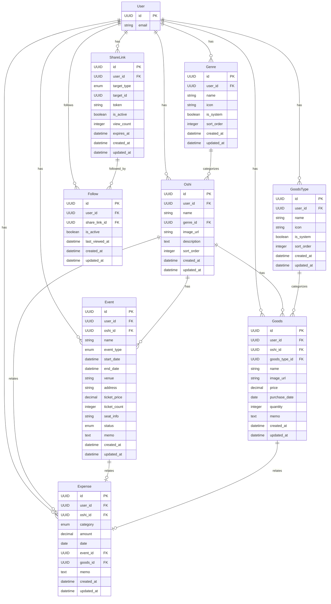

# REQ-004-05: fanship データ一覧

## 概要

fanship（推し活管理アプリ）で扱うデータを定義する。

## エンティティ一覧

### 1. 推し（Oshi）

| 項目 | 内容 |
| ---- | ---- |
| 概要 | ユーザーが応援している対象 |
| 主な属性 | ID、ユーザーID、名前、ジャンル、画像 |

| 属性名 | 型 | 必須 | 説明 |
| ------ | -- | ---- | ---- |
| id | UUID | ○ | 一意識別子 |
| user_id | UUID | ○ | 所有ユーザーID（FK） |
| name | string | ○ | 推しの名前 |
| genre_id | UUID | ○ | ジャンルID（FK） |
| image_url | string | - | プロフィール画像URL |
| description | text | - | メモ・説明 |
| sort_order | integer | ○ | 表示順序 |
| created_at | datetime | ○ | 作成日時 |
| updated_at | datetime | ○ | 更新日時 |

### 2. ジャンル（Genre）

| 項目 | 内容 |
| ---- | ---- |
| 概要 | 推しのジャンル分類 |
| 主な属性 | ID、ユーザーID、名前、アイコン |

| 属性名 | 型 | 必須 | 説明 |
| ------ | -- | ---- | ---- |
| id | UUID | ○ | 一意識別子 |
| user_id | UUID | - | ユーザーID（nullはシステムデフォルト） |
| name | string | ○ | ジャンル名 |
| icon | string | - | アイコン識別子 |
| is_system | boolean | ○ | システムデフォルトフラグ |
| sort_order | integer | ○ | 表示順序 |
| created_at | datetime | ○ | 作成日時 |
| updated_at | datetime | ○ | 更新日時 |

### 3. イベント（Event）

| 項目 | 内容 |
| ---- | ---- |
| 概要 | ライブ、舞台等のイベント |
| 主な属性 | ID、ユーザーID、推しID、名前、日時、場所 |

| 属性名 | 型 | 必須 | 説明 |
| ------ | -- | ---- | ---- |
| id | UUID | ○ | 一意識別子 |
| user_id | UUID | ○ | 所有ユーザーID（FK） |
| oshi_id | UUID | ○ | 推しID（FK） |
| name | string | ○ | イベント名 |
| event_type | enum | ○ | 種別（live/stage/release/other） |
| start_date | datetime | ○ | 開始日時 |
| end_date | datetime | - | 終了日時 |
| venue | string | - | 会場名 |
| address | string | - | 会場住所 |
| ticket_price | decimal | - | チケット金額 |
| ticket_count | integer | - | チケット枚数 |
| seat_info | string | - | 座席情報 |
| status | enum | ○ | ステータス（scheduled/attended/cancelled） |
| memo | text | - | メモ |
| created_at | datetime | ○ | 作成日時 |
| updated_at | datetime | ○ | 更新日時 |

### 4. グッズ（Goods）

| 項目 | 内容 |
| ---- | ---- |
| 概要 | 所持しているグッズ |
| 主な属性 | ID、ユーザーID、推しID、名前、種類、画像 |

| 属性名 | 型 | 必須 | 説明 |
| ------ | -- | ---- | ---- |
| id | UUID | ○ | 一意識別子 |
| user_id | UUID | ○ | 所有ユーザーID（FK） |
| oshi_id | UUID | ○ | 推しID（FK） |
| goods_type_id | UUID | ○ | グッズ種類ID（FK） |
| name | string | ○ | グッズ名 |
| image_url | string | - | グッズ画像URL |
| price | decimal | - | 購入金額 |
| purchase_date | date | - | 購入日 |
| quantity | integer | ○ | 所持数（デフォルト: 1） |
| memo | text | - | メモ |
| created_at | datetime | ○ | 作成日時 |
| updated_at | datetime | ○ | 更新日時 |

### 5. グッズ種類（GoodsType）

| 項目 | 内容 |
| ---- | ---- |
| 概要 | グッズの種類分類 |
| 主な属性 | ID、ユーザーID、名前、アイコン |

| 属性名 | 型 | 必須 | 説明 |
| ------ | -- | ---- | ---- |
| id | UUID | ○ | 一意識別子 |
| user_id | UUID | - | ユーザーID（nullはシステムデフォルト） |
| name | string | ○ | 種類名 |
| icon | string | - | アイコン識別子 |
| is_system | boolean | ○ | システムデフォルトフラグ |
| sort_order | integer | ○ | 表示順序 |
| created_at | datetime | ○ | 作成日時 |
| updated_at | datetime | ○ | 更新日時 |

### 6. 支出（Expense）

| 項目 | 内容 |
| ---- | ---- |
| 概要 | 推し活にかけた費用 |
| 主な属性 | ID、ユーザーID、推しID、カテゴリ、金額 |

| 属性名 | 型 | 必須 | 説明 |
| ------ | -- | ---- | ---- |
| id | UUID | ○ | 一意識別子 |
| user_id | UUID | ○ | 所有ユーザーID（FK） |
| oshi_id | UUID | - | 推しID（FK、特定の推しに紐付く場合） |
| category | enum | ○ | カテゴリ（event/goods/travel/other） |
| amount | decimal | ○ | 金額 |
| date | date | ○ | 支出日 |
| event_id | UUID | - | イベントID（FK、イベント支出の場合） |
| goods_id | UUID | - | グッズID（FK、グッズ支出の場合） |
| memo | text | - | メモ |
| created_at | datetime | ○ | 作成日時 |
| updated_at | datetime | ○ | 更新日時 |

### 7. 共有リンク（ShareLink）

| 項目 | 内容 |
| ---- | ---- |
| 概要 | コンテンツ共有用のリンク |
| 主な属性 | ID、ユーザーID、対象種別、対象ID、トークン |

| 属性名 | 型 | 必須 | 説明 |
| ------ | -- | ---- | ---- |
| id | UUID | ○ | 一意識別子 |
| user_id | UUID | ○ | 所有ユーザーID（FK） |
| target_type | enum | ○ | 対象種別（oshi/event/goods） |
| target_id | UUID | ○ | 対象ID |
| token | string | ○ | 共有トークン（URL識別子） |
| is_active | boolean | ○ | 有効フラグ |
| view_count | integer | ○ | 閲覧数 |
| expires_at | datetime | - | 有効期限 |
| created_at | datetime | ○ | 作成日時 |
| updated_at | datetime | ○ | 更新日時 |

### 8. フォロー（Follow）

| 項目 | 内容 |
| ---- | ---- |
| 概要 | 共有コンテンツのフォロー（購読）情報 |
| 主な属性 | ID、ユーザーID、共有リンクID |

| 属性名 | 型 | 必須 | 説明 |
| ------ | -- | ---- | ---- |
| id | UUID | ○ | 一意識別子 |
| user_id | UUID | ○ | フォローするユーザーID（FK） |
| share_link_id | UUID | ○ | フォロー対象の共有リンクID（FK） |
| is_active | boolean | ○ | 有効フラグ |
| last_viewed_at | datetime | - | 最終閲覧日時 |
| created_at | datetime | ○ | 作成日時 |
| updated_at | datetime | ○ | 更新日時 |

## ER図

## リレーション

| 関係 | 説明 |
| ---- | ---- |
| User : Oshi | 1 : N（1ユーザーは複数の推しを持つ） |
| User : Genre | 1 : N（1ユーザーは複数のジャンルを持つ） |
| User : Event | 1 : N（1ユーザーは複数のイベントを持つ） |
| User : Goods | 1 : N（1ユーザーは複数のグッズを持つ） |
| User : Expense | 1 : N（1ユーザーは複数の支出を持つ） |
| User : Follow | 1 : N（1ユーザーは複数のコンテンツをフォローできる） |
| Genre : Oshi | 1 : N（1ジャンルには複数の推しが属する） |
| Oshi : Event | 1 : N（1推しには複数のイベントがある） |
| Oshi : Goods | 1 : N（1推しには複数のグッズがある） |
| GoodsType : Goods | 1 : N（1種類には複数のグッズが属する） |
| Event : Expense | 1 : 0..1（イベントに紐付く支出） |
| Goods : Expense | 1 : 0..1（グッズに紐付く支出） |
| ShareLink : Follow | 1 : N（1共有リンクは複数のユーザーにフォローされる） |

## デフォルトカテゴリ案

### ジャンル

| ジャンル名 | アイコン |
| ---------- | -------- |
| アイドル | 🎤 |
| 声優 | 🎙️ |
| アニメ | 📺 |
| ゲーム | 🎮 |
| 俳優 | 🎭 |
| アーティスト | 🎵 |
| スポーツ | ⚽ |
| VTuber | 📱 |
| その他 | ⭐ |

### グッズ種類

| 種類名 | アイコン |
| ------ | -------- |
| 缶バッジ | 🔘 |
| アクリルスタンド | 🧍 |
| ぬいぐるみ | 🧸 |
| ペンライト | 🔦 |
| Tシャツ | 👕 |
| タオル | 🧣 |
| CD/DVD | 💿 |
| 写真集 | 📖 |
| ポスター | 🖼️ |
| ブロマイド | 📸 |
| その他 | 📦 |

## データ量見積もり

| エンティティ | 想定レコード数 | 備考 |
| ------------ | -------------- | ---- |
| Oshi | 〜20/ユーザー | 推し数は限定的 |
| Genre | 〜15/ユーザー | デフォルト+カスタム |
| Event | 〜200/ユーザー/年 | 参加イベント数 |
| Goods | 〜500/ユーザー | グッズコレクション |
| GoodsType | 〜20/ユーザー | デフォルト+カスタム |
| Expense | 〜500/ユーザー/年 | 推し活支出記録 |
| ShareLink | 〜50/ユーザー | 共有リンク数 |
| Follow | 〜100/ユーザー | フォロー中のコンテンツ数 |

## 変更履歴

- 2026-02-11: フォローエンティティを追加（リアルタイム更新対応）
- 2026-02-11: 初版作成
