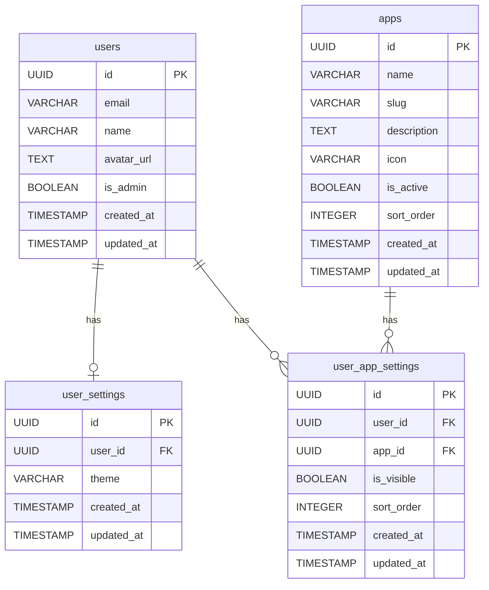

# BSD-001-02: harborix基盤 DB設計

## 概要

harborix基盤のデータベース設計を定義する。

## 設計方針

| 項目 | 方針 |
| ---- | ---- |
| DBMS | Supabase PostgreSQL |
| 命名規則 | snake_case |
| 主キー | UUID |
| タイムスタンプ | created_at, updated_at を全テーブルに付与 |
| RLS | 有効（Row Level Security） |

## テーブル一覧

| テーブル名 | 概要 |
| ---------- | ---- |
| users | ユーザー情報 |
| apps | アプリ情報 |
| user_settings | ユーザー設定 |
| user_app_settings | ユーザーアプリ設定 |

## Cognito連携

usersテーブルはAWS Cognitoと連携する。

| 項目 | 内容 |
| ---- | ---- |
| user_id | Cognito User Pool の sub（UUID形式） |
| 同期タイミング | 初回ログイン時に自動作成 |
| メールアドレス | Cognitoから取得 |

## テーブル定義

### users

| カラム | 型 | NULL | 説明 |
| ------ | -- | ---- | ---- |
| id | UUID | NO | 主キー（Cognito sub） |
| email | VARCHAR(255) | NO | メールアドレス |
| name | VARCHAR(100) | YES | 表示名 |
| avatar_url | TEXT | YES | アバター画像URL |
| is_admin | BOOLEAN | NO | 管理者フラグ（デフォルト: false） |
| created_at | TIMESTAMP | NO | 作成日時 |
| updated_at | TIMESTAMP | NO | 更新日時 |

### apps

| カラム | 型 | NULL | 説明 |
| ------ | -- | ---- | ---- |
| id | UUID | NO | 主キー |
| name | VARCHAR(100) | NO | アプリ名 |
| slug | VARCHAR(50) | NO | URLスラッグ |
| description | TEXT | YES | 説明 |
| icon | VARCHAR(100) | YES | アイコン |
| is_active | BOOLEAN | NO | 有効フラグ |
| sort_order | INTEGER | NO | 表示順 |
| created_at | TIMESTAMP | NO | 作成日時 |
| updated_at | TIMESTAMP | NO | 更新日時 |

### user_settings

| カラム | 型 | NULL | 説明 |
| ------ | -- | ---- | ---- |
| id | UUID | NO | 主キー |
| user_id | UUID | NO | ユーザーID (FK) |
| theme | VARCHAR(20) | NO | テーマ (light/dark/system) |
| created_at | TIMESTAMP | NO | 作成日時 |
| updated_at | TIMESTAMP | NO | 更新日時 |

### user_app_settings

| カラム | 型 | NULL | 説明 |
| ------ | -- | ---- | ---- |
| id | UUID | NO | 主キー |
| user_id | UUID | NO | ユーザーID (FK) |
| app_id | UUID | NO | アプリID (FK) |
| is_visible | BOOLEAN | NO | 表示/非表示 |
| sort_order | INTEGER | YES | ユーザー個別の並び順 |
| created_at | TIMESTAMP | NO | 作成日時 |
| updated_at | TIMESTAMP | NO | 更新日時 |

## ER図

## インデックス

| テーブル | カラム | 種類 |
| -------- | ------ | ---- |
| users | email | UNIQUE |
| apps | slug | UNIQUE |
| user_settings | user_id | UNIQUE |
| user_app_settings | user_id, app_id | UNIQUE |

## 変更履歴

- 2026-02-12: usersにis_adminフラグ追加、user_app_settingsテーブル追加
- 2026-02-12: Supabase PostgreSQL、Cognito連携を記載
- 2026-02-11: 初版作成（テンプレート）
