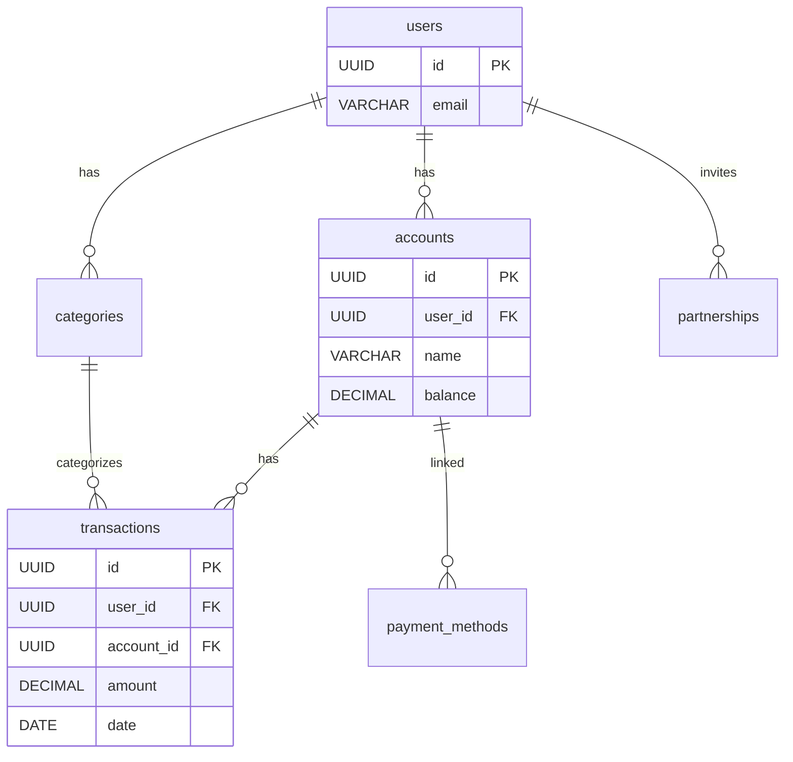

# BSD-002-02: coinship DB設計

## 概要

coinship（家計簿アプリ）のデータベース設計を定義する。

## 設計方針

| 項目 | 方針 |
| ---- | ---- |
| DBMS | Supabase PostgreSQL |
| 命名規則 | snake_case |
| 主キー | UUID |
| タイムスタンプ | created_at, updated_at を全テーブルに付与 |
| RLS | 有効（Row Level Security） |

## テーブル一覧

| テーブル名 | 概要 |
| ---------- | ---- |
| accounts | 口座 |
| payment_methods | 支払い方法 |
| transactions | 取引 |
| categories | カテゴリ |
| partnerships | パートナー共有 |

## テーブル定義

（要件定義のデータ一覧を基に詳細化）

### accounts

| カラム | 型 | NULL | 説明 |
| ------ | -- | ---- | ---- |
| id | UUID | NO | 主キー |
| user_id | UUID | NO | ユーザーID (FK) |
| name | VARCHAR(100) | NO | 口座名 |
| account_type | VARCHAR(20) | NO | 種別 |
| balance | DECIMAL(12,2) | NO | 残高 |
| icon | VARCHAR(100) | YES | アイコン |
| currency | VARCHAR(3) | NO | 通貨コード（デフォルト: JPY） |
| is_shared | BOOLEAN | NO | 共有フラグ |
| sort_order | INTEGER | NO | 表示順 |
| created_at | TIMESTAMP | NO | 作成日時 |
| updated_at | TIMESTAMP | NO | 更新日時 |

### payment_methods

| カラム | 型 | NULL | 説明 |
| ------ | -- | ---- | ---- |
| id | UUID | NO | 主キー |
| user_id | UUID | NO | ユーザーID (FK) |
| account_id | UUID | YES | 引落口座ID (FK) |
| name | VARCHAR(100) | NO | 支払い方法名 |
| payment_type | VARCHAR(20) | NO | 種別 |
| closing_day | INTEGER | YES | 締め日 |
| payment_day | INTEGER | YES | 支払日 |
| sort_order | INTEGER | NO | 表示順 |
| created_at | TIMESTAMP | NO | 作成日時 |
| updated_at | TIMESTAMP | NO | 更新日時 |

### transactions

| カラム | 型 | NULL | 説明 |
| ------ | -- | ---- | ---- |
| id | UUID | NO | 主キー |
| user_id | UUID | NO | ユーザーID (FK) |
| account_id | UUID | NO | 口座ID (FK) |
| payment_method_id | UUID | YES | 支払い方法ID (FK) |
| category_id | UUID | NO | カテゴリID (FK) |
| to_account_id | UUID | YES | 振替先口座ID (FK、振替時のみ) |
| transaction_type | VARCHAR(20) | NO | 種別 (income/expense/transfer) |
| amount | DECIMAL(12,2) | NO | 金額 |
| date | DATE | NO | 取引日 |
| memo | TEXT | YES | メモ |
| point_usage | DECIMAL(12,2) | YES | ポイント利用額 |
| created_at | TIMESTAMP | NO | 作成日時 |
| updated_at | TIMESTAMP | NO | 更新日時 |

### categories

| カラム | 型 | NULL | 説明 |
| ------ | -- | ---- | ---- |
| id | UUID | NO | 主キー |
| user_id | UUID | YES | ユーザーID (FK、nullはシステム) |
| name | VARCHAR(50) | NO | カテゴリ名 |
| category_type | VARCHAR(20) | NO | 種別 (income/expense) |
| icon | VARCHAR(100) | YES | アイコン |
| color | VARCHAR(20) | YES | 色 |
| is_system | BOOLEAN | NO | システムデフォルトフラグ |
| sort_order | INTEGER | NO | 表示順 |
| created_at | TIMESTAMP | NO | 作成日時 |
| updated_at | TIMESTAMP | NO | 更新日時 |

### partnerships

| カラム | 型 | NULL | 説明 |
| ------ | -- | ---- | ---- |
| id | UUID | NO | 主キー |
| inviter_id | UUID | NO | 招待者ID (FK) |
| invitee_id | UUID | YES | 被招待者ID (FK) |
| token | VARCHAR(100) | NO | 招待トークン |
| status | VARCHAR(20) | NO | ステータス |
| expires_at | TIMESTAMP | YES | 招待有効期限 |
| created_at | TIMESTAMP | NO | 作成日時 |
| updated_at | TIMESTAMP | NO | 更新日時 |

## ER図

TODO: 要件定義のER図を基に詳細化

## インデックス

| テーブル | カラム | 種類 |
| -------- | ------ | ---- |
| accounts | user_id | INDEX |
| transactions | user_id, date | INDEX |
| transactions | account_id | INDEX |
| partnerships | token | UNIQUE |
| partnerships | inviter_id, invitee_id | UNIQUE |

## セキュリティ

### パートナー招待トークン

| 項目 | 方針 |
| ---- | ---- |
| トークン生成 | 暗号学的に安全な乱数（UUID v4等） |
| トークン長 | 最低32文字 |
| 有効期限 | 72時間（expires_atで管理） |
| レート制限 | 招待リンク生成は1ユーザーあたり10件/時間 |

## 変更履歴

- 2026-02-12: accounts にcurrency追加、payment_methodsにsort_order追加
- 2026-02-12: transactionsにtransfer対応（to_account_id）追加
- 2026-02-12: partnershipsにexpires_at追加、招待トークンセキュリティ追加
- 2026-02-12: Supabase PostgreSQL、RLSを設計方針に追加
- 2026-02-11: 初版作成（テンプレート）
