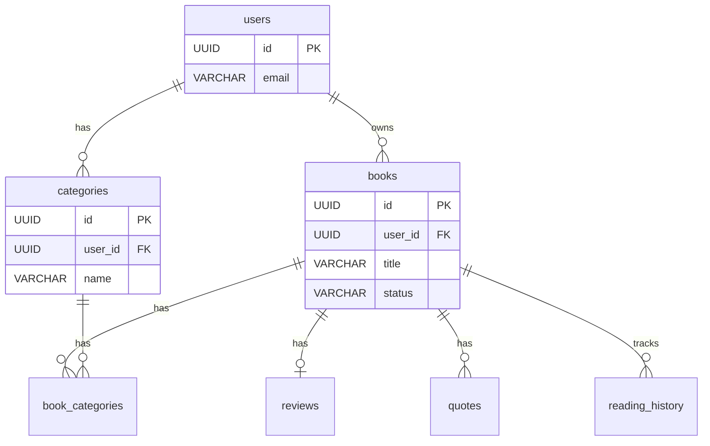

# BSD-003-02: libship DB設計

## 概要

libship（読書管理アプリ）のデータベース設計を定義する。

## 設計方針

| 項目 | 方針 |
| ---- | ---- |
| DBMS | Supabase PostgreSQL |
| 命名規則 | snake_case |
| 主キー | UUID |
| タイムスタンプ | created_at, updated_at を全テーブルに付与 |
| RLS | 有効（Row Level Security） |

## テーブル一覧

| テーブル名 | 概要 |
| ---------- | ---- |
| books | 本 |
| categories | カテゴリ |
| book_categories | 本とカテゴリの関連 |
| reviews | 感想 |
| quotes | 引用 |
| reading_history | 読書履歴 |

## テーブル定義

### books

| カラム | 型 | NULL | 説明 |
| ------ | -- | ---- | ---- |
| id | UUID | NO | 主キー |
| user_id | UUID | NO | ユーザーID (FK) |
| title | VARCHAR(200) | NO | タイトル |
| author | VARCHAR(100) | YES | 著者 |
| publisher | VARCHAR(100) | YES | 出版社 |
| isbn | VARCHAR(20) | YES | ISBN |
| cover_url | TEXT | YES | 表紙画像URL |
| total_pages | INTEGER | YES | 総ページ数 |
| status | VARCHAR(20) | NO | 状態 (unread/reading/completed) |
| current_page | INTEGER | YES | 現在ページ |
| rating | INTEGER | YES | 評価 (1-5) |
| start_date | DATE | YES | 読書開始日 |
| end_date | DATE | YES | 読了日 |
| created_at | TIMESTAMP | NO | 作成日時 |
| updated_at | TIMESTAMP | NO | 更新日時 |

### categories

| カラム | 型 | NULL | 説明 |
| ------ | -- | ---- | ---- |
| id | UUID | NO | 主キー |
| user_id | UUID | YES | ユーザーID (FK、nullはシステム) |
| name | VARCHAR(50) | NO | カテゴリ名 |
| color | VARCHAR(20) | YES | 色 |
| is_system | BOOLEAN | NO | システムデフォルトフラグ |
| sort_order | INTEGER | NO | 表示順 |
| created_at | TIMESTAMP | NO | 作成日時 |
| updated_at | TIMESTAMP | NO | 更新日時 |

### book_categories

| カラム | 型 | NULL | 説明 |
| ------ | -- | ---- | ---- |
| id | UUID | NO | 主キー |
| book_id | UUID | NO | 本ID (FK) |
| category_id | UUID | NO | カテゴリID (FK) |
| created_at | TIMESTAMP | NO | 作成日時 |

### reviews

| カラム | 型 | NULL | 説明 |
| ------ | -- | ---- | ---- |
| id | UUID | NO | 主キー |
| book_id | UUID | NO | 本ID (FK) |
| content | TEXT | YES | 感想内容 |
| created_at | TIMESTAMP | NO | 作成日時 |
| updated_at | TIMESTAMP | NO | 更新日時 |

### quotes

| カラム | 型 | NULL | 説明 |
| ------ | -- | ---- | ---- |
| id | UUID | NO | 主キー |
| book_id | UUID | NO | 本ID (FK) |
| content | TEXT | NO | 引用内容 |
| page | INTEGER | YES | ページ番号 |
| memo | TEXT | YES | メモ |
| created_at | TIMESTAMP | NO | 作成日時 |
| updated_at | TIMESTAMP | NO | 更新日時 |

### reading_history

| カラム | 型 | NULL | 説明 |
| ------ | -- | ---- | ---- |
| id | UUID | NO | 主キー |
| book_id | UUID | NO | 本ID (FK) |
| page | INTEGER | NO | ページ数 |
| recorded_at | TIMESTAMP | NO | 記録日時 |

## ER図

TODO: 要件定義のER図を基に詳細化

## インデックス

| テーブル | カラム | 種類 |
| -------- | ------ | ---- |
| books | user_id | INDEX |
| books | isbn | INDEX |
| books | status | INDEX |
| book_categories | book_id, category_id | UNIQUE |
| quotes | book_id | INDEX |

## 変更履歴

- 2026-02-12: book_categoriesにid、created_atを追加（REQ-003-05と統一）
- 2026-02-12: Supabase PostgreSQL、RLSを設計方針に追加
- 2026-02-11: 初版作成（テンプレート）
