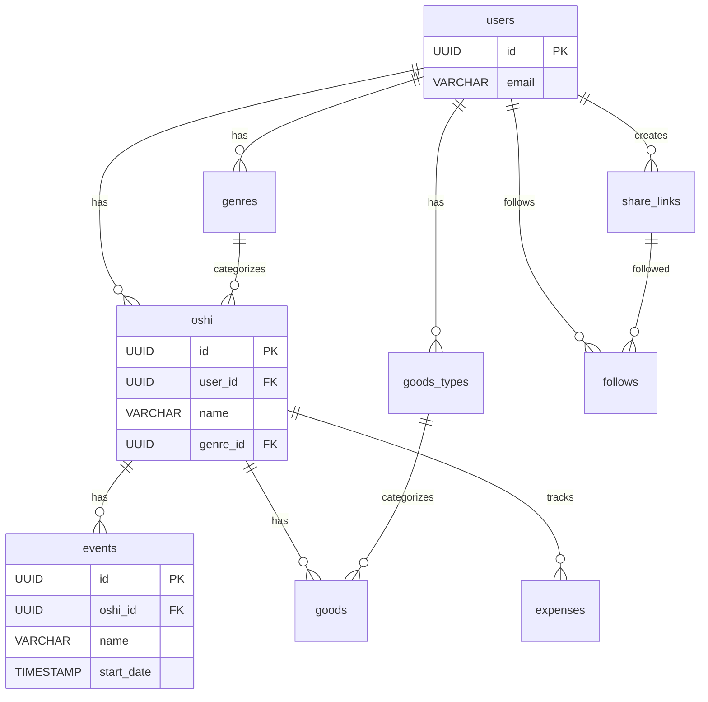

# BSD-004-02: fanship DB設計

## 概要

fanship（推し活管理アプリ）のデータベース設計を定義する。

## 設計方針

| 項目 | 方針 |
| ---- | ---- |
| DBMS | Supabase PostgreSQL |
| 命名規則 | snake_case |
| 主キー | UUID |
| タイムスタンプ | created_at, updated_at を全テーブルに付与 |
| RLS | 有効（Row Level Security） |

## テーブル一覧

| テーブル名 | 概要 |
| ---------- | ---- |
| oshi | 推し |
| genres | ジャンル |
| events | イベント |
| goods | グッズ |
| goods_types | グッズ種類 |
| expenses | 支出 |
| share_links | 共有リンク |
| follows | フォロー |

## テーブル定義

### oshi

| カラム | 型 | NULL | 説明 |
| ------ | -- | ---- | ---- |
| id | UUID | NO | 主キー |
| user_id | UUID | NO | ユーザーID (FK) |
| name | VARCHAR(100) | NO | 推しの名前 |
| genre_id | UUID | NO | ジャンルID (FK) |
| image_url | TEXT | YES | プロフィール画像URL |
| description | TEXT | YES | メモ・説明 |
| sort_order | INTEGER | NO | 表示順序 |
| created_at | TIMESTAMP | NO | 作成日時 |
| updated_at | TIMESTAMP | NO | 更新日時 |

### genres

| カラム | 型 | NULL | 説明 |
| ------ | -- | ---- | ---- |
| id | UUID | NO | 主キー |
| user_id | UUID | YES | ユーザーID (nullはシステム) |
| name | VARCHAR(50) | NO | ジャンル名 |
| icon | VARCHAR(100) | YES | アイコン |
| is_system | BOOLEAN | NO | システムデフォルトフラグ |
| sort_order | INTEGER | NO | 表示順序 |
| created_at | TIMESTAMP | NO | 作成日時 |
| updated_at | TIMESTAMP | NO | 更新日時 |

### events

| カラム | 型 | NULL | 説明 |
| ------ | -- | ---- | ---- |
| id | UUID | NO | 主キー |
| user_id | UUID | NO | ユーザーID (FK) |
| oshi_id | UUID | NO | 推しID (FK) |
| name | VARCHAR(200) | NO | イベント名 |
| event_type | VARCHAR(20) | NO | 種別 |
| start_date | TIMESTAMP | NO | 開始日時 |
| end_date | TIMESTAMP | YES | 終了日時 |
| venue | VARCHAR(200) | YES | 会場名 |
| address | TEXT | YES | 会場住所 |
| ticket_price | DECIMAL(10,2) | YES | チケット金額 |
| ticket_count | INTEGER | YES | チケット枚数 |
| seat_info | VARCHAR(100) | YES | 座席情報 |
| status | VARCHAR(20) | NO | ステータス |
| memo | TEXT | YES | メモ |
| created_at | TIMESTAMP | NO | 作成日時 |
| updated_at | TIMESTAMP | NO | 更新日時 |

### goods

| カラム | 型 | NULL | 説明 |
| ------ | -- | ---- | ---- |
| id | UUID | NO | 主キー |
| user_id | UUID | NO | ユーザーID (FK) |
| oshi_id | UUID | NO | 推しID (FK) |
| goods_type_id | UUID | NO | グッズ種類ID (FK) |
| name | VARCHAR(200) | NO | グッズ名 |
| image_url | TEXT | YES | グッズ画像URL |
| price | DECIMAL(10,2) | YES | 購入金額 |
| purchase_date | DATE | YES | 購入日 |
| quantity | INTEGER | NO | 所持数 |
| memo | TEXT | YES | メモ |
| created_at | TIMESTAMP | NO | 作成日時 |
| updated_at | TIMESTAMP | NO | 更新日時 |

### goods_types

| カラム | 型 | NULL | 説明 |
| ------ | -- | ---- | ---- |
| id | UUID | NO | 主キー |
| user_id | UUID | YES | ユーザーID (nullはシステム) |
| name | VARCHAR(50) | NO | 種類名 |
| icon | VARCHAR(100) | YES | アイコン |
| is_system | BOOLEAN | NO | システムデフォルトフラグ |
| sort_order | INTEGER | NO | 表示順序 |
| created_at | TIMESTAMP | NO | 作成日時 |
| updated_at | TIMESTAMP | NO | 更新日時 |

### expenses

| カラム | 型 | NULL | 説明 |
| ------ | -- | ---- | ---- |
| id | UUID | NO | 主キー |
| user_id | UUID | NO | ユーザーID (FK) |
| oshi_id | UUID | YES | 推しID (FK) |
| category | VARCHAR(20) | NO | カテゴリ |
| amount | DECIMAL(10,2) | NO | 金額 |
| date | DATE | NO | 支出日 |
| event_id | UUID | YES | イベントID (FK) |
| goods_id | UUID | YES | グッズID (FK) |
| memo | TEXT | YES | メモ |
| created_at | TIMESTAMP | NO | 作成日時 |
| updated_at | TIMESTAMP | NO | 更新日時 |

### share_links

| カラム | 型 | NULL | 説明 |
| ------ | -- | ---- | ---- |
| id | UUID | NO | 主キー |
| user_id | UUID | NO | ユーザーID (FK) |
| target_type | VARCHAR(20) | NO | 対象種別 |
| target_id | UUID | NO | 対象ID |
| token | VARCHAR(100) | NO | 共有トークン |
| is_active | BOOLEAN | NO | 有効フラグ |
| view_count | INTEGER | NO | 閲覧数 |
| expires_at | TIMESTAMP | YES | 有効期限 |
| created_at | TIMESTAMP | NO | 作成日時 |
| updated_at | TIMESTAMP | NO | 更新日時 |

### follows

| カラム | 型 | NULL | 説明 |
| ------ | -- | ---- | ---- |
| id | UUID | NO | 主キー |
| user_id | UUID | NO | ユーザーID (FK) |
| share_link_id | UUID | NO | 共有リンクID (FK) |
| is_active | BOOLEAN | NO | 有効フラグ |
| last_viewed_at | TIMESTAMP | YES | 最終閲覧日時 |
| created_at | TIMESTAMP | NO | 作成日時 |
| updated_at | TIMESTAMP | NO | 更新日時 |

## ER図

TODO: 要件定義のER図を基に詳細化

## インデックス

| テーブル | カラム | 種類 |
| -------- | ------ | ---- |
| oshi | user_id | INDEX |
| events | user_id, start_date | INDEX |
| events | oshi_id | INDEX |
| goods | user_id | INDEX |
| goods | oshi_id | INDEX |
| expenses | user_id, date | INDEX |
| share_links | token | UNIQUE |
| follows | user_id, share_link_id | UNIQUE |

## セキュリティ

### 共有リンクトークン

| 項目 | 方針 |
| ---- | ---- |
| トークン生成 | 暗号学的に安全な乱数（crypto/rand等） |
| トークン長 | 最低32文字 |
| 有効化/無効化 | is_activeフラグで制御（手動で無効化可能） |
| レート制限 | 共有リンク生成は1ユーザーあたり50件/日 |
| 有効期限 | デフォルトは無期限（expires_atで個別に設定可能） |

## 変更履歴

- 2026-02-12: 共有リンクトークンのセキュリティ方針を追加
- 2026-02-12: Supabase PostgreSQL、RLSを設計方針に追加
- 2026-02-11: 初版作成（テンプレート）
